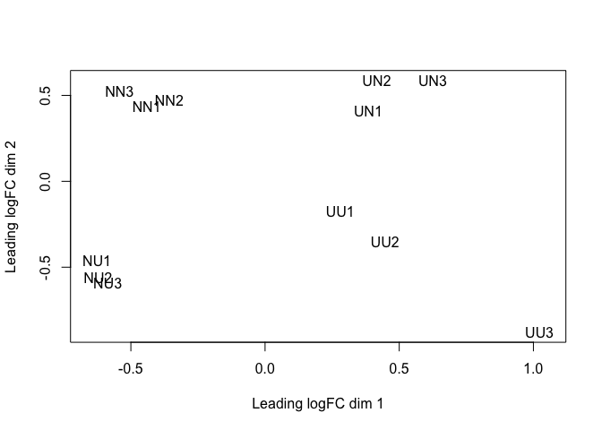
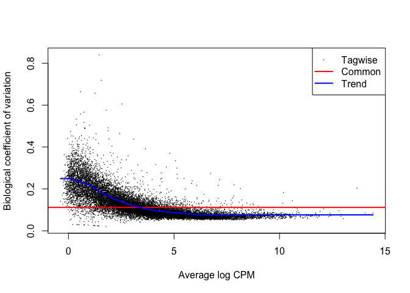
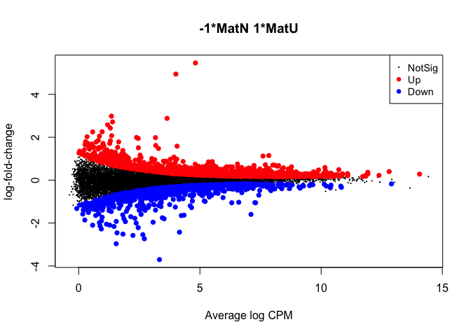
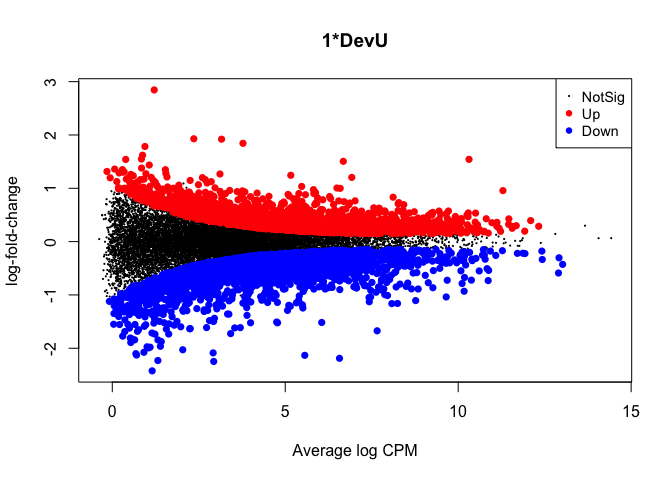
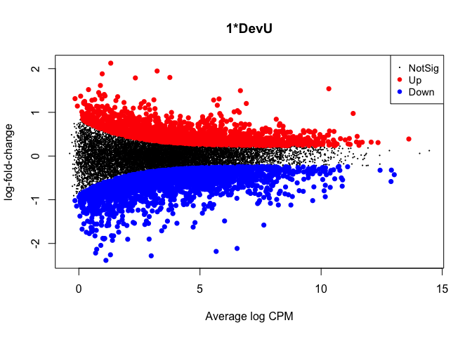

edgeR\_DE\_Sp\_RRBS\_ATAC
================
Sam Bogan
5/14/2021

This is an R markdown document detailing edgeR analysis of differential expression for the Sp\_RRBS\_ATAC repo, a documentation of analyses by Sam Bogan, Marie Strader, and Gretchen Hofmann that aimed to understand the gene regulatory effects of DNA methylation during transgenerational plasticity in the purple sea urchin Strongylocentrotus purpuratus and how these effects are regulated by other epigenomic and genomic states.

The code below reads in and filters an RNAseq count matrix, performs a PCA of each sample, and then fits a multifactorial glm from which pariwise contrasts are made to estimate differential expression between treatment groups. Developmental treatment: larval S. purpuratus reared in experimental upwelling or non-upwelling conditions. Maternal treatment: larval S. purpuratus spawned from mothers exposed to experimental upwelling or non-upwelling conditions.

This markdown finishes by outputing two dataframes containing logCPM, logFC, and p-values for differential expression produced by contrasts between developmental and maternal treatments.

Prior to this analysis, reads were mapped to the Spur\_3.1.42 assembly and annotation using HiSat2 and counted using \_\_\_\_\_\_ as detailed in Strader et al. 2020: <https://www.frontiersin.org/articles/10.3389/fmars.2020.00205/full>. Relevant scripts for alignment and read counting can be found at: <https://github.com/mariestrader/S.purp_RRBS_RNAseq_2019>.

# Read in, filter, and multiQC data

``` r
# Load required packages
library( edgeR )
```

    ## Warning: package 'edgeR' was built under R version 3.6.2

    ## Loading required package: limma

    ## Warning: package 'limma' was built under R version 3.6.2

``` r
library( tidyverse )
```

    ## ── Attaching packages ─────────────────────────────────────── tidyverse 1.3.0 ──

    ## ✓ ggplot2 3.3.3     ✓ purrr   0.3.4
    ## ✓ tibble  3.0.6     ✓ dplyr   1.0.4
    ## ✓ tidyr   1.1.2     ✓ stringr 1.4.0
    ## ✓ readr   1.4.0     ✓ forcats 0.5.1

    ## Warning: package 'ggplot2' was built under R version 3.6.2

    ## Warning: package 'tibble' was built under R version 3.6.2

    ## Warning: package 'tidyr' was built under R version 3.6.2

    ## Warning: package 'readr' was built under R version 3.6.2

    ## Warning: package 'purrr' was built under R version 3.6.2

    ## Warning: package 'dplyr' was built under R version 3.6.2

    ## Warning: package 'forcats' was built under R version 3.6.2

    ## ── Conflicts ────────────────────────────────────────── tidyverse_conflicts() ──
    ## x dplyr::filter() masks stats::filter()
    ## x dplyr::lag()    masks stats::lag()

``` r
library( pheatmap )
library( ape )
```

    ## Warning: package 'ape' was built under R version 3.6.2

``` r
library( vegan )
```

    ## Warning: package 'vegan' was built under R version 3.6.2

    ## Loading required package: permute

    ## Loading required package: lattice

    ## Warning: package 'lattice' was built under R version 3.6.2

    ## This is vegan 2.5-7

``` r
# Read in csv of read counts per gene
gene_counts <- read.csv( "Input_data/gene_read_counts.csv" )

# Remove duplicated transcripts
n_occur_gc <- data.frame( table(gene_counts$Geneid ) )
n_occur_gc <- n_occur_gc[ n_occur_gc$Freq > 1, ]
n_occur_gc <- n_occur_gc$Var1

gene_counts <- gene_counts[ ! gene_counts$Geneid %in% n_occur_gc, ]

#Make gene id matrix rowname
row.names( gene_counts ) <- gene_counts$Geneid

gene_counts <- subset( gene_counts, 
                       select = -c( Geneid, Chr, Start, End, Strand, Length ) )
```

``` r
# Replace sample IDs with simple names
colnames( gene_counts ) <- c( "NN1","NN2","NN3","NU1","NU2","NU3",
                     "UN1","UN2","UN3","UU1","UU2","UU3" )

# Create treatment group df
Mat = c( "N","N","N","N","N","N",
         "U","U","U","U","U","U" )

Dev = c( "N","N","N","U","U","U",
         "N","N","N","U","U","U" )

targets_gc <- data.frame( Mat = c( "N","N","N","N","N","N",
                                   "U","U","U","U","U","U" ), 
                          Dev = c( "N","N","N","U","U","U",
                                   "N","N","N","U","U","U" ) )

targets_gc$grouping <- paste( targets_gc$Mat, 
                             targets_gc$Dev,
                             sep="_" )

#Round counts if necessary for use in edgeR
data_input_gc <- round( gene_counts )
```

``` r
# Make a DGEList
DGEList <- DGEList( counts = data_input_gc, 
                    group = targets_gc$grouping, 
                    remove.zeros = T )
```

    ## Removing 4952 rows with all zero counts

``` r
# Let's remove samples with less then 0.5 cpm (this is ~10 counts in the count file) in no fewer then 9 samples
DGEList_keep <- rowSums( cpm( DGEList ) > 0.5 ) >= 9

# How many genes are removed by read count filter?
table( DGEList_keep )
```

    ## DGEList_keep
    ## FALSE  TRUE 
    ##  9029 16303

``` r
# Set keep.lib.sizes = F to have R recalculate library sizes after filtering
DGEList <- DGEList[ DGEList_keep, 
                    keep.lib.sizes = FALSE ]

# Create library size normalization factors
DGEList <- calcNormFactors( DGEList )


# CPM conversion and log^2 transformation of read counts
DGEList_log <- cpm( DGEList,
                    log = TRUE, 
                    prior.count = 2 )

# MDS of normalized exon read counts
MDS <- plotMDS( DGEList_log )
```



``` r
# Print MDS plot
MDS
```

    ## An object of class MDS
    ## $dim.plot
    ## [1] 1 2
    ## 
    ## $distance.matrix
    ##          NN1      NN2      NN3      NU1      NU2      NU3      UN1      UN2
    ## NN1 0.000000 0.000000 0.000000 0.000000 0.000000 0.000000 0.000000 0.000000
    ## NN2 1.428469 0.000000 0.000000 0.000000 0.000000 0.000000 0.000000 0.000000
    ## NN3 1.453132 1.514300 0.000000 0.000000 0.000000 0.000000 0.000000 0.000000
    ## NU1 1.671521 1.709999 1.746536 0.000000 0.000000 0.000000 0.000000 0.000000
    ## NU2 1.703568 1.761809 1.772715 1.481573 0.000000 0.000000 0.000000 0.000000
    ## NU3 1.681239 1.777870 1.724383 1.500776 1.517584 0.000000 0.000000 0.000000
    ## UN1 1.693166 1.722990 1.720781 1.885675 1.937823 1.911928 0.000000 0.000000
    ## UN2 1.648042 1.684617 1.726495 1.925065 1.986647 2.002105 1.568989 0.000000
    ## UN3 1.771468 1.751174 1.857023 2.050400 2.061421 2.075279 1.625086 1.593878
    ## UU1 1.738838 1.801833 1.808938 1.721246 1.762439 1.738643 1.612247 1.634304
    ## UU2 1.839525 1.851830 1.937838 1.833784 1.819042 1.774611 1.728966 1.754788
    ## UU3 2.217913 2.197867 2.317108 2.130798 2.118608 2.075327 2.016856 2.054692
    ##          UN3      UU1      UU2 UU3
    ## NN1 0.000000 0.000000 0.000000   0
    ## NN2 0.000000 0.000000 0.000000   0
    ## NN3 0.000000 0.000000 0.000000   0
    ## NU1 0.000000 0.000000 0.000000   0
    ## NU2 0.000000 0.000000 0.000000   0
    ## NU3 0.000000 0.000000 0.000000   0
    ## UN1 0.000000 0.000000 0.000000   0
    ## UN2 0.000000 0.000000 0.000000   0
    ## UN3 0.000000 0.000000 0.000000   0
    ## UU1 1.778502 0.000000 0.000000   0
    ## UU2 1.787488 1.564110 0.000000   0
    ## UU3 2.029097 1.901086 1.834484   0
    ## 
    ## $cmdscale.out
    ##           [,1]       [,2]
    ## NN1 -0.4412984  0.4343841
    ## NN2 -0.3571122  0.4732091
    ## NN3 -0.5423382  0.5247847
    ## NU1 -0.6265556 -0.4606308
    ## NU2 -0.6222231 -0.5585566
    ## NU3 -0.5863413 -0.5900779
    ## UN1  0.3844756  0.4109691
    ## UN2  0.4164270  0.5861353
    ## UN3  0.6250172  0.5858480
    ## UU1  0.2802710 -0.1740786
    ## UU2  0.4470462 -0.3536402
    ## UU3  1.0226318 -0.8783462
    ## 
    ## $top
    ## [1] 500
    ## 
    ## $gene.selection
    ## [1] "pairwise"
    ## 
    ## $x
    ##        NN1        NN2        NN3        NU1        NU2        NU3        UN1 
    ## -0.4412984 -0.3571122 -0.5423382 -0.6265556 -0.6222231 -0.5863413  0.3844756 
    ##        UN2        UN3        UU1        UU2        UU3 
    ##  0.4164270  0.6250172  0.2802710  0.4470462  1.0226318 
    ## 
    ## $y
    ##        NN1        NN2        NN3        NU1        NU2        NU3        UN1 
    ##  0.4343841  0.4732091  0.5247847 -0.4606308 -0.5585566 -0.5900779  0.4109691 
    ##        UN2        UN3        UU1        UU2        UU3 
    ##  0.5861353  0.5858480 -0.1740786 -0.3536402 -0.8783462 
    ## 
    ## $axislabel
    ## [1] "Leading logFC dim"

``` r
# Run pcoa on read counts
pcoa_gc <- pcoa( vegdist( t( DGEList_log <- cpm ( DGEList, 
                                                  log = TRUE, 
                                                  prior.count = 2 ) ), 
                          method = "euclidean" ) / 1000 )

# Print sample scores across vectors
head( pcoa_gc$vectors )
```

    ##           Axis.1       Axis.2        Axis.3        Axis.4        Axis.5
    ## NN1 -0.026568073 -0.008656190  0.0070963478  0.0074712453  0.0047101833
    ## NN2 -0.024468794 -0.003034360  0.0141527713  0.0068743690  0.0081443602
    ## NN3 -0.032824963 -0.009636454  0.0060014416  0.0171324908 -0.0010127111
    ## NU1  0.009074835 -0.027294437  0.0009254015 -0.0154988856 -0.0088824152
    ## NU2  0.012371072 -0.029667844  0.0042784348 -0.0154089285 -0.0002445781
    ## NU3  0.015286171 -0.028287756 -0.0001437379  0.0005923961  0.0040426530
    ##            Axis.6        Axis.7       Axis.8       Axis.9      Axis.10
    ## NN1 -0.0007604117 -0.0009807580  0.002225455  0.008623741 -0.006098279
    ## NN2 -0.0011895572  0.0076329778 -0.002907772  0.011244749  0.025510481
    ## NN3  0.0053392889 -0.0116135967  0.002412909 -0.003173279 -0.018145058
    ## NU1 -0.0114768357  0.0123880511 -0.017211751  0.012510254 -0.011534077
    ## NU2 -0.0012441025  0.0007414662  0.029566590 -0.004650000  0.002464760
    ## NU3  0.0122129146 -0.0072038874 -0.017021373 -0.021985404  0.008377531
    ##          Axis.11
    ## NN1  0.029261362
    ## NN2 -0.009893666
    ## NN3 -0.017051700
    ## NU1 -0.005029752
    ## NU2 -0.001978285
    ## NU3  0.005028531

``` r
# Create model design that includes maternal and developmental effects and set intercept to 0
design_multi_gc <- model.matrix( ~0 + Mat + Dev )

# Add column names to model matrix
colnames( design_multi_gc ) <- c( "MatN", "MatU", "DevU" ) 

# Calculate dispersal/coefficients of variation for expression per gene and across all genes
DGEList <- estimateDisp( DGEList, 
                         design_multi_gc, 
                         robust = TRUE )

# Plot gene-wise and average dispersal/CV
plotBCV ( DGEList )
```



``` r
## Use GLM tagwise and common dispersion instead of estimateDisp

# Filter and normalize count matrix input
gene_counts_matrix <- as.matrix(gene_counts)

DGEList <- DGEList( counts = gene_counts_matrix, 
                    group = targets_gc$grouping, 
                    remove.zeros = T )
```

    ## Removing 4952 rows with all zero counts

``` r
DGEList <- DGEList[ DGEList_keep, 
                    keep.lib.sizes=FALSE ]

DGEList <- calcNormFactors( DGEList )

# Estimate mean dispersal
DGEList_1 <- estimateGLMCommonDisp( DGEList, 
                                    design_multi_gc )

# Estmate dispersal per gene
DGEList_1 <- estimateGLMTagwiseDisp( DGEList_1, 
                                     design_multi_gc ) 

# Plot tagwise dispersal impose w/mean dispersal and trendline
plotBCV( DGEList_1 ) 
```



``` r
#Fit a robust, multifactorial quasi-likelihood glm to normalized read counts
fit_gc <- glmQLFit( DGEList_1, 
                        design_multi_gc, robust = TRUE ) 
```

# Perform differential expression analyses

``` r
## Pairwise comparison of maternal differential expression

# Design contrast between samples based on maternal effect
con_Maternal <- makeContrasts( con_Maternal_cons = MatU - MatN,
                               levels = design_multi_gc )

# Run likelihood ratio tests of differential expression due to maternal effect
maternal_LRT <- glmLRT( fit_gc, 
                           contrast = con_Maternal )

# Plot maternal logFC across logCPM (fdr < 0.05)
plotMD( maternal_LRT )
```



``` r
# How many significant DEGs? 2051
summary( decideTestsDGE( maternal_LRT, 
                         adjust.method = "fdr",
                         p.value = 0.05 ) )
```

    ##        -1*MatN 1*MatU
    ## Down             1008
    ## NotSig          14252
    ## Up               1043

``` r
# Filter for significance and logFC cutoff (doubling of fold change or logFC of 1)
maternal_LRT_cutoff <- topTags( maternal_LRT, 
                                   n = 2051, 
                                   adjust.method = "fdr",
                                   p.value = 0.05 )

# Create df of logFC and sign cutoff DEGs
maternal_LRT_cutoff_df <- data.frame( maternal_LRT_cutoff$table )
maternal_LRT_fc_cutoff_df <- maternal_LRT_cutoff_df[ !( abs( maternal_LRT_cutoff_df$logFC ) < 1 ), ]

# Count total DEGs with logFC cutoff
nrow( maternal_LRT_cutoff_df ) # Without logFC cutoff
```

    ## [1] 2051

``` r
nrow( maternal_LRT_fc_cutoff_df ) # With logFC cutoff
```

    ## [1] 244

``` r
## Pairwise comparison of developmental differential expression

# Pairwise comparison of developmental differential expression
con_Dev <- makeContrasts( con_Dev_cons = DevU, 
                          levels = design_multi_gc)

dev_LRT <- glmLRT( fit_gc, 
                   contrast = con_Dev )

# Plot maternal logFC across logCPM (fdr < 0.05)
plotMD( dev_LRT )
```



``` r
# How many significant DEGs? 4234
summary( decideTestsDGE( dev_LRT, 
                         adjust.method = "fdr",
                         p.value = 0.05 ) )
```

    ##        1*DevU
    ## Down     2288
    ## NotSig  12069
    ## Up       1946

``` r
# Filter for significance and logFC cutoff
dev_LRT_cutoff <- topTags( dev_LRT, 
                                n = 4234, 
                                adjust.method = "fdr",
                                p.value = 0.05 )

# Create df of logFC and sig cutoff DEGs (doubling of fold change or logFC of 1)
dev_LRT_cutoff_df <- data.frame( dev_LRT_cutoff$table )
dev_LRT_fc_cutoff_df <- dev_LRT_cutoff_df[ !( abs( dev_LRT_cutoff_df$logFC ) < 1 ), ]

# Count total DEGs with logFC cutoff
nrow( dev_LRT_cutoff_df ) # Without logFC cutoff
```

    ## [1] 4234

``` r
nrow( dev_LRT_fc_cutoff_df ) # With logFC cutoff
```

    ## [1] 298

``` r
# Export maternal and developmental glm table as .csv files
write.csv( maternal_LRT$table, 
           "Output_data/maternal_edgeR_GE_table_filt.csv")

write.csv( dev_LRT$table, 
          "Output_data/dev_edgeR_GE_table_filt.csv" )
```
