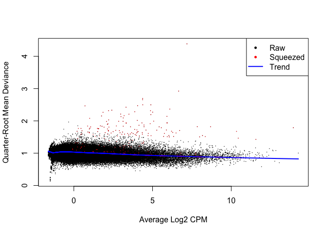
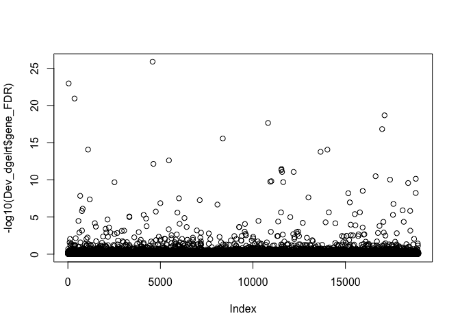

A2\_edgeR\_DS\_Sp\_RRBS
================
Sam Bogan
5/27/2021

This is an R markdown document detailing edgeR analysis of differential splicing for the Sp\_RRBS\_ATAC repo, a documentation of analyses by Sam Bogan, Marie Strader, and Gretchen Hofmann that aimed to understand the gene regulatory effects of DNA methylation during transgenerational plasticity in the purple sea urchin *Strongylocentrotus purpuratus* and how these effects are regulated by other epigenomic and genomic states.

The code below reads in and filters an RNAseq count matrix, performs a PCA of each sample, and then fits a multifactorial glm from which pariwise contrasts are made to estimate differential splicing between treatment groups. Developmental treatment: larval S. purpuratus reared in experimental upwelling or non-upwelling conditions. Maternal treatment: larval S. purpuratus spawned from mothers exposed to experimental upwelling or non-upwelling conditions.

This markdown finishes by outputing four dataframes: 2 containing lists of differential spliced genes (DSGs) and likelihood statistics for their splicing corresponding to the maternal and developmental treatments and two dataframes containing differential exon use coefficients corresponding to both treatments.

Prior to this analysis, reads were mapped to the Spur\_3.1.42 assembly and annotation using HiSat2 and counted using featureCounts in the subread package as detailed in Strader et al. 2020: <https://www.frontiersin.org/articles/10.3389/fmars.2020.00205/full>. Relevant scripts for alignment and read counting can be found at: <https://github.com/mariestrader/S.purp_RRBS_RNAseq_2019>.

# Read in, filter, and multiQC data

``` r
# Load required packages
library( edgeR )
```

    ## Warning: package 'edgeR' was built under R version 3.6.2

    ## Loading required package: limma

    ## Warning: package 'limma' was built under R version 3.6.2

``` r
library( tidyverse )
```

    ## Warning: package 'tidyverse' was built under R version 3.6.2

    ## ── Attaching packages ─────────────────────────────────────── tidyverse 1.3.1 ──

    ## ✓ ggplot2 3.3.3     ✓ purrr   0.3.4
    ## ✓ tibble  3.1.2     ✓ dplyr   1.0.6
    ## ✓ tidyr   1.1.3     ✓ stringr 1.4.0
    ## ✓ readr   1.4.0     ✓ forcats 0.5.1

    ## Warning: package 'ggplot2' was built under R version 3.6.2

    ## Warning: package 'tibble' was built under R version 3.6.2

    ## Warning: package 'tidyr' was built under R version 3.6.2

    ## Warning: package 'readr' was built under R version 3.6.2

    ## Warning: package 'purrr' was built under R version 3.6.2

    ## Warning: package 'dplyr' was built under R version 3.6.2

    ## Warning: package 'forcats' was built under R version 3.6.2

    ## ── Conflicts ────────────────────────────────────────── tidyverse_conflicts() ──
    ## x dplyr::filter() masks stats::filter()
    ## x dplyr::lag()    masks stats::lag()

``` r
library( pheatmap )
library( ape )
```

    ## Warning: package 'ape' was built under R version 3.6.2

``` r
library( vegan )
```

    ## Warning: package 'vegan' was built under R version 3.6.2

    ## Loading required package: permute

    ## Loading required package: lattice

    ## Warning: package 'lattice' was built under R version 3.6.2

    ## This is vegan 2.5-7

``` r
library( VennDiagram )
```

    ## Loading required package: grid

    ## Loading required package: futile.logger

    ## 
    ## Attaching package: 'VennDiagram'

    ## The following object is masked from 'package:ape':
    ## 
    ##     rotate

``` r
library( plyr )
```

    ## ------------------------------------------------------------------------------

    ## You have loaded plyr after dplyr - this is likely to cause problems.
    ## If you need functions from both plyr and dplyr, please load plyr first, then dplyr:
    ## library(plyr); library(dplyr)

    ## ------------------------------------------------------------------------------

    ## 
    ## Attaching package: 'plyr'

    ## The following objects are masked from 'package:dplyr':
    ## 
    ##     arrange, count, desc, failwith, id, mutate, rename, summarise,
    ##     summarize

    ## The following object is masked from 'package:purrr':
    ## 
    ##     compact

``` r
# Read in exon read count matrix
exon_counts <- read.csv( "Input_data/exon_read_counts.csv" )

# Remove rows corresponding to duplicated exon ids
n_occur_ex <- data.frame( table( exon_counts$Geneid ) )

duplicated_exons <- n_occur_ex[ n_occur_ex$Freq > 1, ]

dup_exon_list <- duplicated_exons$Var1

exon_counts <- exon_counts[ ! exon_counts$Geneid %in% dup_exon_list, ]

# Make gene id matrix rowname
row.names( exon_counts ) <- exon_counts$Geneid

# Subset df to include necessary data only
exon_counts <- subset( exon_counts, select = -c( Geneid, 
                                                 Chr, 
                                                 Start, 
                                                 End, 
                                                 Strand, 
                                                 Length ) )
```

``` r
# Replace sample IDs with simple names stating treatment groups
colnames( exon_counts ) <- c( "NN1", "NN2", "NN3",
                              "NU1", "NU2", "NU3",
                              "UN1", "UN2", "UN3",
                              "UU1", "UU2", "UU3" )

# Make experimental design tables for edgeR
Mat <- c( "N", "N", "N", "N", "N", "N",
            "U", "U", "U", "U", "U", "U" )

Dev <- c( "N", "N", "N", "U", "U", "U",
          "N", "N", "N", "U", "U", "U" )

targets_ec <- data.frame( Mat, Dev )

targets_ec$grouping <- paste( targets_ec$Mat,
                               targets_ec$Dev,
                               sep="_" )

# Round counts if necessary
data_input_ec <- round( exon_counts )
```

``` r
# Apply read depth filter from whole genes
load( "Output_data/DGEList_keep.Rdata" ) 

# Look at DGEList_keep
keep_geneids <- gsub( "transcript:",
                      "",
                      gsub( "-tr.*",
                            "",
                            row.names( data_input_ec ) ) )

# Make geneid column in DGEList$counts for filtering based on transcript-level counts
data_input_ec$geneid <- gsub( "-tr.*",
                            "",
                            row.names( data_input_ec ) )

# Filter exon data based on transcript-level read counts
data_input_ec <- dplyr::filter( data_input_ec,
                                geneid %in% keep_geneids )

data_input_ec <- data_input_ec[, !( names( data_input_ec ) == "geneid" ) ]

# Convert counts back to matrix
data_input_ec <- as.matrix( data_input_ec )

# Make a DGEList
DGEList_ex <- DGEList( counts = data_input_ec, 
                       group = targets_ec$grouping, 
                       remove.zeros = T )
```

    ## Removing 64801 rows with all zero counts

``` r
# Create library size normalization factors
DGEList_ex <- calcNormFactors( DGEList_ex )


# CPM conversion and log^2 transformation of read counts
DGEList_ex_log <- cpm( DGEList_ex, 
                       log = TRUE, 
                       prior.count = 2 )

# MDS of normalized exon read counts
MDS_ex <- plotMDS( DGEList_ex_log )
```


``` r
MDS_ex
```

    ## An object of class MDS
    ## $dim.plot
    ## [1] 1 2
    ## 
    ## $distance.matrix
    ##          NN1      NN2      NN3      NU1      NU2      NU3      UN1      UN2
    ## NN1 0.000000 0.000000 0.000000 0.000000 0.000000 0.000000 0.000000 0.000000
    ## NN2 2.450424 0.000000 0.000000 0.000000 0.000000 0.000000 0.000000 0.000000
    ## NN3 2.387056 2.480044 0.000000 0.000000 0.000000 0.000000 0.000000 0.000000
    ## NU1 2.577049 2.626047 2.620124 0.000000 0.000000 0.000000 0.000000 0.000000
    ## NU2 2.572906 2.596123 2.621005 2.609122 0.000000 0.000000 0.000000 0.000000
    ## NU3 2.568820 2.605746 2.549685 2.582728 2.555872 0.000000 0.000000 0.000000
    ## UN1 2.611649 2.685212 2.674680 2.816501 2.775842 2.786143 0.000000 0.000000
    ## UN2 2.618997 2.684919 2.647888 2.718287 2.806262 2.809917 2.612760 0.000000
    ## UN3 2.728576 2.727543 2.798164 2.899928 2.844068 2.868169 2.713045 2.663709
    ## UU1 2.560319 2.629993 2.646282 2.686619 2.638529 2.650056 2.587083 2.599086
    ## UU2 2.680572 2.720636 2.765028 2.760489 2.718190 2.737602 2.685757 2.666753
    ## UU3 3.063506 3.029518 3.107270 3.044768 2.975493 2.999373 2.926645 2.974635
    ##          UN3      UU1      UU2 UU3
    ## NN1 0.000000 0.000000 0.000000   0
    ## NN2 0.000000 0.000000 0.000000   0
    ## NN3 0.000000 0.000000 0.000000   0
    ## NU1 0.000000 0.000000 0.000000   0
    ## NU2 0.000000 0.000000 0.000000   0
    ## NU3 0.000000 0.000000 0.000000   0
    ## UN1 0.000000 0.000000 0.000000   0
    ## UN2 0.000000 0.000000 0.000000   0
    ## UN3 0.000000 0.000000 0.000000   0
    ## UU1 2.651154 0.000000 0.000000   0
    ## UU2 2.750141 2.573858 0.000000   0
    ## UU3 2.940059 2.868312 2.877242   0
    ## 
    ## $cmdscale.out
    ##           [,1]        [,2]
    ## NN1 -0.6524806  0.24178677
    ## NN2 -0.5476164  0.08137333
    ## NN3 -0.7968745  0.16723637
    ## NU1 -0.6068740 -0.57795205
    ## NU2 -0.4396744 -0.74283411
    ## NU3 -0.5830025 -0.76078656
    ## UN1  0.3472850  0.69447936
    ## UN2  0.2417517  0.86107877
    ## UN3  0.6410695  0.87006449
    ## UU1  0.2394039  0.21289917
    ## UU2  0.4630359  0.05622714
    ## UU3  1.6939764 -1.10357269
    ## 
    ## $top
    ## [1] 500
    ## 
    ## $gene.selection
    ## [1] "pairwise"
    ## 
    ## $x
    ##        NN1        NN2        NN3        NU1        NU2        NU3        UN1 
    ## -0.6524806 -0.5476164 -0.7968745 -0.6068740 -0.4396744 -0.5830025  0.3472850 
    ##        UN2        UN3        UU1        UU2        UU3 
    ##  0.2417517  0.6410695  0.2394039  0.4630359  1.6939764 
    ## 
    ## $y
    ##         NN1         NN2         NN3         NU1         NU2         NU3 
    ##  0.24178677  0.08137333  0.16723637 -0.57795205 -0.74283411 -0.76078656 
    ##         UN1         UN2         UN3         UU1         UU2         UU3 
    ##  0.69447936  0.86107877  0.87006449  0.21289917  0.05622714 -1.10357269 
    ## 
    ## $axislabel
    ## [1] "Leading logFC dim"

``` r
# Run pcoa on gene read counts
pcoa_ec = pcoa( vegdist( t( DGEList_ex_log <- cpm( DGEList_ex,
                                                        log = TRUE,
                                                        prior.count = 2 ) ), 
                              method = "euclidean" ) / 1000 )

# Print sample scores across vectors
head( pcoa_ec$vectors )
```

    ##           Axis.1       Axis.2        Axis.3      Axis.4      Axis.5
    ## NN1 -0.059684181  0.004461702  0.0440231375  0.01746001  0.03246401
    ## NN2 -0.052212395 -0.001114352  0.0485677326  0.01457321  0.03828546
    ## NN3 -0.072938292  0.001769923  0.0478671711  0.03190432  0.03259664
    ## NU1 -0.010013998  0.069219280  0.0001003077 -0.02534940 -0.01221858
    ## NU2 -0.004596415  0.088688497 -0.0078698519 -0.06394474 -0.05531221
    ## NU3 -0.002160379  0.082863650 -0.0049469596 -0.01863320 -0.00322459
    ##            Axis.6      Axis.7       Axis.8        Axis.9      Axis.10
    ## NN1  2.815183e-03  0.03098422 -0.015537908  0.0238306794 -0.077330659
    ## NN2  1.277305e-03  0.04331775 -0.005192515  0.0014535620  0.126081094
    ## NN3 -1.159460e-06  0.02877950  0.003362493  0.0215647240 -0.045945219
    ## NU1  5.097390e-02 -0.05568459 -0.116392611 -0.0428483019  0.001515321
    ## NU2 -1.146516e-01  0.02728888  0.010629393  0.0007908101 -0.001259564
    ## NU3  8.049528e-02 -0.02320098  0.111016816 -0.0313705078 -0.002598863
    ##          Axis.11
    ## NN1  0.101107195
    ## NN2  0.019993140
    ## NN3 -0.112941158
    ## NU1 -0.009897305
    ## NU2 -0.002203826
    ## NU3  0.006260442

``` r
# Create model design that includes maternal and developmental effects and set intercept to 0
design_multi_ec <- model.matrix( ~0 + Mat + Dev )

# Add column names to model matrix
colnames( design_multi_ec ) <- c( "MatN", "MatU", "DevU" ) 

# Estmate mean dispersal for use in plotting common dispersal against tagwise dispersal
DGEList_ex <- estimateDisp( DGEList_ex, 
                       design_multi_ec, 
                       robust = TRUE )

# Plot tagwise dispersal and impose w/mean dispersal and trendline
plotBCV( DGEList_ex )
```


``` r
# Save a vector of exon ids
exons <- row.names( DGEList_ex_log )

# Fit a robust, multifactorial quasi-likelihood glm to normalized read counts
fit_ec <- glmQLFit( DGEList_ex, 
                     design_multi_ec, 
                     robust = TRUE ) 

# Plot shrinkage of Bayesian quasi-likelihood dispersion (not indicative of DSG analysis power as Bayesian shrinkage cannot be used)
plotQLDisp( fit_ec ) # High shrinkage
```



# Perform differential splicing analyses

``` r
## Maternal DSGs

# Extract exon ids
exon_ids <- row.names( DGEList_ex$counts )

# Trim exon ids down to gene ids
gene_ids <- gsub( "-.*",
                  "", 
                  exon_ids )

# Design contrast between samples based on maternal effect
con_Mat <- makeContrasts( con_Mat = MatU - MatN ,
                          levels = design_multi_ec )

# Apply quasi-likelihood F test to incorporate Bayesian tagwise dispersion estimates as parameter for DEG analysis
Mat_dgelrt <- diffSpliceDGE( fit_ec, 
                               coef = ncol( targets_ec ), 
                               contrast = con_Mat, 
                               gene_ids, 
                               exonid = exon_ids, 
                               prior.count = 0.125, 
                               verbose = TRUE )
```

    ## Total number of exons:  123938 
    ## Total number of genes:  25196 
    ## Number of genes with 1 exon:  6254 
    ## Mean number of exons in a gene:  5 
    ## Max number of exons in a gene:  98

``` r
## Adjust p-values w/ FDR

# Simes p-value, corresponding to DSGs associated with many differential exon use events of small effect
Mat_dgelrt$Simes_FDR <- p.adjust( Mat_dgelrt$gene.Simes.p.value,
                                  "fdr" )

# Gene p-value, corresponding to DSGs associated with a few differential exon use events of large effect
Mat_dgelrt$gene_FDR <- p.adjust( Mat_dgelrt$gene.p.value,
                                 "fdr" )

# Gene p-value, corresponding to exons undergoing differential use relative to its gene
Mat_dgelrt$exon_FDR <- p.adjust( Mat_dgelrt$exon.p.value,
                                 "fdr" )

## Count significant DSGs and exons

# Simes FDR < 0.05
sum( Mat_dgelrt$Simes_FDR < 0.05 )
```

    ## [1] 63

``` r
# Gene FDR < 0.05
sum( Mat_dgelrt$gene_FDR < 0.05 )
```

    ## [1] 275

``` r
# Exon FDR < 0.05
sum( Mat_dgelrt$exon_FDR < 0.05 )
```

    ## [1] 91

``` r
# Plot -log gene FDR values
plot( -log10(Mat_dgelrt$gene_FDR ) )
```


``` r
#Dev DSGs

# Design contrast between samples based on maternal effect
con_Dev <- makeContrasts( con_Dev = DevU, 
                          levels = design_multi_ec )

# Apply quasi-likelihood F test to incorporate Bayesian tagwise dispersion estimates as parameter for DEG analysis
Dev_dgelrt <- diffSpliceDGE( fit_ec, 
                             coef = ncol( ldp_targets ), 
                             contrast = con_Dev, 
                             gene_ids, 
                             exonid = exon_ids, 
                             prior.count = 0.125,
                             verbose = TRUE )
```

    ## Total number of exons:  123938 
    ## Total number of genes:  25196 
    ## Number of genes with 1 exon:  6254 
    ## Mean number of exons in a gene:  5 
    ## Max number of exons in a gene:  98

``` r
## Adjust p-values w/ FDR

# Simes p-value, corresponding to DSGs associated with many differential exon use events of small effect
Dev_dgelrt$Simes_FDR <- p.adjust( Dev_dgelrt$gene.Simes.p.value,
                                  "fdr" )

# Gene p-value, corresponding to DSGs associated with a few differential exon use events of large effect
Dev_dgelrt$gene_FDR <- p.adjust( Dev_dgelrt$gene.p.value,
                                 "fdr" )

# Gene p-value, corresponding to exons undergoing differential use relative to its gene
Dev_dgelrt$exon_FDR <- p.adjust( Dev_dgelrt$exon.p.value,
                                 "fdr" )

## Count significant DSGs and exons

# Simes FDR < 0.05
sum( Dev_dgelrt$Simes_FDR < 0.05 )
```

    ## [1] 71

``` r
# Gene FDR < 0.05
sum( Dev_dgelrt$gene_FDR < 0.05 )
```

    ## [1] 222

``` r
# Exon FDR < 0.05
sum( Dev_dgelrt$exon_FDR < 0.05 )
```

    ## [1] 125

``` r
# Plot -log gene FDR values
plot( -log10(Dev_dgelrt$gene_FDR ) )
```



# Determine which DSGs are due to spuriousness or alternative TSS

Genes exhibiting increased spurious expression or an increase in alternative TSS towar the 3' direction will be identified by diffspliceDGE as significant DSGs. Below, exon DEU coefficients are fit to linear models in order to identify genes with low, negative intercepts and positive slopes across exon number as these parameters are consistent with alt TSS and spuriousness. geneids of spurious and alt TSS will then be filtered from the DSG dataframes corresponding to maternal and developmental treatments.

``` r
## Create 'exon info' dfs

# First, exon info df for maternal treatment
DSGs_Mat_exon_info <- data.frame( exon_id = Mat_dgelrt$exoncolname, 
                                  exon_coeff = Mat_dgelrt$coefficients, 
                                  exon_pval = Mat_dgelrt$exon.F,
                                  Treat = "Maternal" )

# Create exon number variable
DSGs_Mat_exon_info$exon_num <- gsub( ".*-E",
                                     "", 
                                     row.names( DSGs_Mat_exon_info) )
DSGs_Mat_exon_info$exon_num <- as.numeric( DSGs_Mat_exon_info$exon_num )

# Create geneid variable
DSGs_Mat_exon_info$geneid <- gsub( "-tr-E.*",
                                   "", 
                                   row.names( DSGs_Mat_exon_info ) )

# Then, exon info df for Devernal treatment
DSGs_Dev_exon_info <- data.frame( exon_id = Dev_dgelrt$exoncolname, 
                                  exon_coeff = Dev_dgelrt$coefficients, 
                                  exon_pval = Dev_dgelrt$exon.F,
                                  Treat = "Developmental" )

# Create exon number variable
DSGs_Dev_exon_info$exon_num <- gsub( ".*-E",
                                     "", 
                                     row.names( DSGs_Dev_exon_info) )
DSGs_Dev_exon_info$exon_num <- as.numeric( DSGs_Dev_exon_info$exon_num )

# Create geneid variable
DSGs_Dev_exon_info$geneid <- gsub( "-tr-E.*",
                                   "", 
                                   row.names( DSGs_Dev_exon_info ) )


# Create df of spuriously expressed genes
DSGs_Mat_exon_info$lm_id <- paste( DSGs_Mat_exon_info$geneid,
                                    DSGs_Mat_exon_info$Treat, 
                                   sep = "_" )

DSGs_Dev_exon_info$lm_id <- paste( DSGs_Dev_exon_info$geneid,
                                    DSGs_Dev_exon_info$Treat, 
                                   sep = "_" )

All_exon_info <- rbind( DSGs_Mat_exon_info, 
                        DSGs_Dev_exon_info )

# Linear models applied to identify DSGs to be filtered out for spurious criterion or alt TSS
spur_models <- dlply( All_exon_info, 
                      c( "lm_id", "geneid", "Treat" ), 
                      function( df ) lm( exon_coeff ~ exon_num, data = df ) )

# Apply coef to each model and return a data frame
spur_models_coef <- ldply( spur_models, 
                           coef )

# Extract p-values from spur models
spur_models_coef <- setNames( spur_models_coef, 
                              c("lm_id", "geneid", "Treat", "intercept", "slope" ) )

# Remove NAs from spuriousness/alt TSS coef df
spur_models_coef <- data.frame( spur_models_coef[ complete.cases( spur_models_coef ), ] )

# Df of model coeffs for DSGs for filtering that requires significant effect of exon number on DEU
non_p_coef_filt <- dplyr::filter( spur_models_coef, intercept < -0.25 &
                                    slope > 0 )

# Subset genes without spurious transcription or alt TSS
non_spur_models = subset( 
  spur_models_coef, !( geneid %in% non_p_coef_filt ) )

# Export df of model coeffs for spurious or alt TSS genes
write.csv( non_p_coef_filt, 
           "Output_data/non_p_coef_filt.csv" )

# Export df of model coeffs for genes without spurious transcription or alt TSS
write.csv( non_spur_models, 
           "Output_data/non_spur_models.csv" )

# Create a vector of genes that should be filtered out of maternal DSG dataset
mat_spur_transcripts <- dplyr::filter( non_p_coef_filt, 
                              Treat == "Maternal" )

# Create a vector of genes that should be filtered out of developmental DSG dataset
dev_spur_transcripts  <- dplyr::filter( non_p_coef_filt, 
                              Treat == "Developmental" )
```

``` r
## Create lists of DSGs after filtering for with with changes to alt TSS or spuriousness

# Create %notin% syntax
`%notin%` <- negate(`%in%`)

# Mat DSGs df with geneids, p-values, and fdr values
DSGs_Mat_gene_info <- data.frame( gene_p_value = Mat_dgelrt$gene.p.value, 
                                  gene_FDR = Mat_dgelrt$gene_FDR )
DSGs_Mat_gene_info_sig <- DSGs_Mat_gene_info[ ( DSGs_Mat_gene_info$gene_FDR < 0.05 ), ]
DSGs_Mat_gene_info_sig$geneid <- row.names( DSGs_Mat_gene_info_sig )

# Filter out genes with changes to alt TSS and spuriousness
DSGs_Mat_gene_info_sig <- dplyr::filter( DSGs_Mat_gene_info_sig, 
                                  geneid %notin% mat_spur_transcripts$geneid )

# Pull list of sig DSGs from filtered DSG df
DSGs_Mat_sig_list <- row.names( DSGs_Mat_gene_info_sig )

# How many maternal DSGs left after filtering?
length( DSGs_Mat_sig_list )
```

    ## [1] 121

``` r
# Dev DSGs df with geneids, p-values, and fdr values
DSGs_Dev_gene_info <- data.frame( gene_p_value = Dev_dgelrt$gene.p.value, 
                                  gene_FDR = Dev_dgelrt$gene_FDR )
DSGs_Dev_gene_info_sig <- DSGs_Dev_gene_info[ ( DSGs_Dev_gene_info$gene_FDR < 0.05 ), ]
DSGs_Dev_gene_info_sig$geneid <- row.names( DSGs_Dev_gene_info_sig )

# Filter out genes with changes to alt TSS and spuriousness
DSGs_Dev_gene_info_sig <- dplyr::filter( DSGs_Dev_gene_info_sig, 
                                  geneid %notin% dev_spur_transcripts$geneid )

# Pull list of sig DSGs from filtered DSG df
DSGs_Dev_sig_list <- row.names( DSGs_Dev_gene_info_sig )

# How many developmental DSGs left after filtering?
length( DSGs_Dev_sig_list )
```

    ## [1] 78

# Output DEU df and data for GO enrichment

``` r
## Output maternal and developmental exon use coefficient data

# Filter out exons in DEU df from spurious or alt TSS genes
DSGs_Mat_exon_info <- filter( DSGs_Mat_exon_info,
                              geneid %notin% mat_spur_transcripts$geneid  )

DSGs_Dev_exon_info <- filter( DSGs_Dev_exon_info,
                              geneid %notin% dev_spur_transcripts$geneid  )

# Export CSVs
write.csv( DSGs_Mat_exon_info,
           "Output_data/Mat_DEU_df.csv" )

write.csv( DSGs_Dev_exon_info,
           "Output_data/Dev_DEU_df.csv" )

## Output DSG -log pvals and geneids for gene ontology Mann-Whitney U test

# Create dfs
DSGs_Mat_pval <- data.frame( geneid = row.names( DSGs_Mat_gene_info ), 
                                    neg_log_pval = -log( DSGs_Mat_gene_info$gene_p_value ) )

DSGs_Dev_pval <- data.frame( geneid = row.names( DSGs_Dev_gene_info ), 
                                    neg_log_pval = -log( DSGs_Dev_gene_info$gene_p_value ) )

# Export CSVs
write.csv( DSGs_Mat_pval,
           "Output_data/DSGs_Mat_pval.csv" )

write.csv( DSGs_Dev_pval,
           "Output_data/DSGs_Dev_pval.csv" )
```
