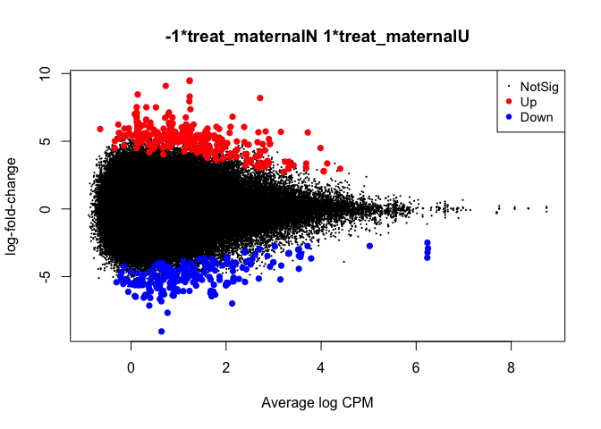
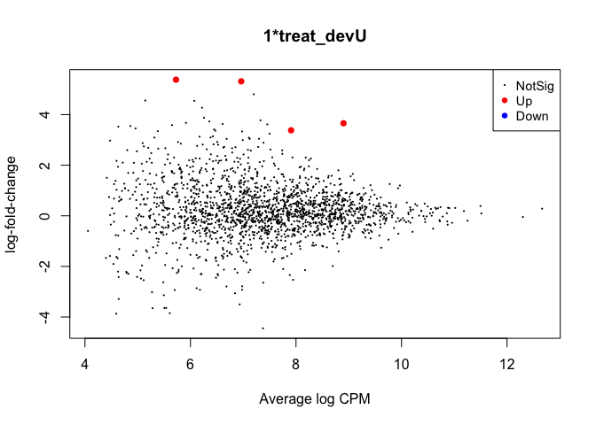

A3\_edgeR\_DM\_Sp\_RRBS
================
Sam Bogan
6/26/2021

This is an R markdown document detailing edgeR analysis of differential methylation for the Sp\_RRBS\_ATAC repo, a documentation of analyses by Sam Bogan, Marie Strader, and Gretchen Hofmann that aimed to understand the gene regulatory effects of DNA methylation during transgenerational plasticity in the purple sea urchin *Strongylocentrotus purpuratus* and how these effects are regulated by other epigenomic and genomic states.

The code below reads in and filters Bismark .cov files and methylation count files, performs a PCA of each sample, and then fits a edgeR multifactorial glm from which pariwise contrasts are made to estimate differential methylation between treatment groups. Developmental treatment: larval *S. purpuratus* reared in experimental upwelling or non-upwelling conditions. Maternal treatment: larval *S. purpuratus* spawned from mothers exposed to experimental upwelling or non-upwelling conditions.

This markdown finishes by outputing twelve dataframes containing lists of differential methylation coefficients and likelihood statistics at CpGs, promoters, single exons, genewise exons, single introns, and genewise introns corresponding to the maternal and developmental treatments.

Prior to these analyses, RRBS reads were mapped to the bisulfite-converted Spur\_3.1.42 assembly and annotation using Bismark. Methylation output files were produced by running the bismark\_methylation\_extractor command and summary files were produced by the bismark2summary command as detailed in Strader et al. 2020: <https://www.frontiersin.org/articles/10.3389/fmars.2020.00205/full>. Relevant scripts for alignment and methylation calling can be found at: <https://github.com/mariestrader/S.purp_RRBS_RNAseq_2019>.

``` r
# Load required packages
library( methylKit )
```

    ## Loading required package: GenomicRanges

    ## Loading required package: stats4

    ## Loading required package: BiocGenerics

    ## Loading required package: parallel

    ## 
    ## Attaching package: 'BiocGenerics'

    ## The following objects are masked from 'package:parallel':
    ## 
    ##     clusterApply, clusterApplyLB, clusterCall, clusterEvalQ,
    ##     clusterExport, clusterMap, parApply, parCapply, parLapply,
    ##     parLapplyLB, parRapply, parSapply, parSapplyLB

    ## The following objects are masked from 'package:stats':
    ## 
    ##     IQR, mad, sd, var, xtabs

    ## The following objects are masked from 'package:base':
    ## 
    ##     anyDuplicated, append, as.data.frame, basename, cbind, colnames,
    ##     dirname, do.call, duplicated, eval, evalq, Filter, Find, get, grep,
    ##     grepl, intersect, is.unsorted, lapply, Map, mapply, match, mget,
    ##     order, paste, pmax, pmax.int, pmin, pmin.int, Position, rank,
    ##     rbind, Reduce, rownames, sapply, setdiff, sort, table, tapply,
    ##     union, unique, unsplit, which, which.max, which.min

    ## Loading required package: S4Vectors

    ## Warning: package 'S4Vectors' was built under R version 3.6.3

    ## 
    ## Attaching package: 'S4Vectors'

    ## The following object is masked from 'package:base':
    ## 
    ##     expand.grid

    ## Loading required package: IRanges

    ## Warning: package 'IRanges' was built under R version 3.6.2

    ## Loading required package: GenomeInfoDb

    ## Warning: package 'GenomeInfoDb' was built under R version 3.6.3

``` r
library( edgeR )
```

    ## Warning: package 'edgeR' was built under R version 3.6.2

    ## Loading required package: limma

    ## Warning: package 'limma' was built under R version 3.6.2

    ## 
    ## Attaching package: 'limma'

    ## The following object is masked from 'package:BiocGenerics':
    ## 
    ##     plotMA

``` r
library( genomation )
```

    ## Loading required package: grid

    ## 
    ## Attaching package: 'genomation'

    ## The following objects are masked from 'package:methylKit':
    ## 
    ##     getFeatsWithTargetsStats, getFlanks, getMembers,
    ##     getTargetAnnotationStats, plotTargetAnnotation

``` r
library( GenomicRanges )
library( reshape2 )
```

    ## Warning: package 'reshape2' was built under R version 3.6.2

``` r
library( ggplot2 )
```

    ## Warning: package 'ggplot2' was built under R version 3.6.2

``` r
library( vegan )
```

    ## Warning: package 'vegan' was built under R version 3.6.2

    ## Loading required package: permute

    ## Loading required package: lattice

    ## Warning: package 'lattice' was built under R version 3.6.2

    ## This is vegan 2.5-7

``` r
library( rgl )
```

    ## Warning: package 'rgl' was built under R version 3.6.2

``` r
library( ape )
```

    ## Warning: package 'ape' was built under R version 3.6.2

    ## 
    ## Attaching package: 'ape'

    ## The following object is masked from 'package:methylKit':
    ## 
    ##     reconstruct

``` r
library( adegenet )
```

    ## Warning: package 'adegenet' was built under R version 3.6.2

    ## Loading required package: ade4

    ## Warning: package 'ade4' was built under R version 3.6.2

    ## 
    ## Attaching package: 'ade4'

    ## The following object is masked from 'package:GenomicRanges':
    ## 
    ##     score

    ## The following object is masked from 'package:BiocGenerics':
    ## 
    ##     score

    ## Registered S3 method overwritten by 'spdep':
    ##   method   from
    ##   plot.mst ape

    ## 
    ##    /// adegenet 2.1.3 is loaded ////////////
    ## 
    ##    > overview: '?adegenet'
    ##    > tutorials/doc/questions: 'adegenetWeb()' 
    ##    > bug reports/feature requests: adegenetIssues()

``` r
library( VennDiagram )
```

    ## Loading required package: futile.logger

    ## 
    ## Attaching package: 'VennDiagram'

    ## The following object is masked from 'package:ape':
    ## 
    ##     rotate

``` r
library( dplyr )
```

    ## Warning: package 'dplyr' was built under R version 3.6.2

    ## 
    ## Attaching package: 'dplyr'

    ## The following object is masked from 'package:methylKit':
    ## 
    ##     select

    ## The following objects are masked from 'package:GenomicRanges':
    ## 
    ##     intersect, setdiff, union

    ## The following object is masked from 'package:GenomeInfoDb':
    ## 
    ##     intersect

    ## The following objects are masked from 'package:IRanges':
    ## 
    ##     collapse, desc, intersect, setdiff, slice, union

    ## The following objects are masked from 'package:S4Vectors':
    ## 
    ##     first, intersect, rename, setdiff, setequal, union

    ## The following objects are masked from 'package:BiocGenerics':
    ## 
    ##     combine, intersect, setdiff, union

    ## The following objects are masked from 'package:stats':
    ## 
    ##     filter, lag

    ## The following objects are masked from 'package:base':
    ## 
    ##     intersect, setdiff, setequal, union

``` r
library( gridExtra )
```

    ## 
    ## Attaching package: 'gridExtra'

    ## The following object is masked from 'package:dplyr':
    ## 
    ##     combine

    ## The following object is masked from 'package:BiocGenerics':
    ## 
    ##     combine

``` r
library( plyr )
```

    ## ------------------------------------------------------------------------------

    ## You have loaded plyr after dplyr - this is likely to cause problems.
    ## If you need functions from both plyr and dplyr, please load plyr first, then dplyr:
    ## library(plyr); library(dplyr)

    ## ------------------------------------------------------------------------------

    ## 
    ## Attaching package: 'plyr'

    ## The following objects are masked from 'package:dplyr':
    ## 
    ##     arrange, count, desc, failwith, id, mutate, rename, summarise,
    ##     summarize

    ## The following object is masked from 'package:IRanges':
    ## 
    ##     desc

    ## The following object is masked from 'package:S4Vectors':
    ## 
    ##     rename

``` r
library( strex )
```

    ## Warning: package 'strex' was built under R version 3.6.2

    ## Loading required package: stringr

# Differential methylation at individual CpGs

``` r
## Read in Bismark methyl count outputs
# Set working directory containing .cov files
setwd( "~/Documents/GitHub/Sp_RRBS_ATAC/A_Differential_Exp_Splicing_Meth/Input_data/" )

# Read in delimeters of .cov files
NN_1 <- read.delim( "NN1.cov", header = F, nrows = 6 )
NN_2 <- read.delim( "NN2.cov", header = F, nrows = 6 )
NN_3 <- read.delim( "NN3.cov", header = F, nrows = 6 )
NU_1 <- read.delim( "NU1.cov", header = F, nrows = 6 )
NU_2 <- read.delim( "NU2.cov", header = F, nrows = 6 )
NU_3 <- read.delim( "NU3.cov", header = F, nrows = 6 )
UN_1 <- read.delim( "UN1.cov", header = F, nrows = 6 )
UN_2 <- read.delim( "UN2.cov", header = F, nrows = 6 )
UN_3 <- read.delim( "UN3.cov", header = F, nrows = 6 )
UU_1 <- read.delim( "UU1.cov", header = F, nrows = 6 )
UU3_1 <- read.delim( "UU3_1.cov", header = F, nrows = 6 )
UU3_2 <- read.delim( "UU3_2.cov", header = F, nrows = 6 )

# Create df of sample  IDs
targets <-
  data.frame(
  row.names = c(
  "NN1",
  "NN2",
  "NN3",
  "NU1",
  "NU2",
  "NU3",
  "UN1",
  "UN2",
  "UN3",
  "UU1",
  "UU3_1",
  "UU3_2"
  )
  )

# Add maternal and developmental treatment info to df of sample IDs 
targets$treat = substr( row.names( targets ), 1, 2 )
targets$treat_maternal = substr( row.names( targets ), 1, 1)
targets$treat_dev = substr( row.names( targets ), 2, 2 )

# Read in Bismark .cov files
Sample <- row.names( targets )
files <- paste0( Sample, ".cov" )
yall <- readBismark2DGE( files, sample.names = Sample )
```

    ## Reading NN1.cov 
    ## Reading NN2.cov 
    ## Reading NN3.cov 
    ## Reading NU1.cov 
    ## Reading NU2.cov 
    ## Reading NU3.cov 
    ## Reading UN1.cov 
    ## Reading UN2.cov 
    ## Reading UN3.cov 
    ## Reading UU1.cov 
    ## Reading UU3_1.cov 
    ## Reading UU3_2.cov 
    ## Hashing ...
    ## Collating counts ...

``` r
dim( yall ) #9354108      24
```

    ## [1] 9354108      24

``` r
# Call binary methylation scores across CpGs
Methylation <- gl( 2, 1, ncol( yall ), labels = c( "Me", "Un") )

# Create matrix of read coverage
Me <- yall$counts[ , Methylation == "Me" ]
Un <- yall$counts[ , Methylation == "Un" ]
Coverage <- Me + Un

# Filter CpGs based on read coverage: at least 10 reads across all 12 samples
HasCoverage <- rowSums( Coverage >= 10 ) == 12
table( HasCoverage )
```

    ## HasCoverage
    ##   FALSE    TRUE 
    ## 9107424  246684

``` r
#HasCoverage
#  FALSE    TRUE 
#9107424  246684 
y <- yall[ HasCoverage , keep.lib.sizes = FALSE ]

# Calculate RRBS library sizes
TotalLibSize <-
  y$samples$lib.size[ Methylation == "Me" ] + y$samples$lib.size[ Methylation == "Un" ]
  y$samples$lib.size <- rep( TotalLibSize, each = 2 )

# Create new methylated and unmethylated count matrices post-filtering
Me <- y$counts[ , Methylation == "Me" ]
Un <- y$counts[ , Methylation == "Un" ]
M <- log2( Me + 2 ) - log2( Un + 2 )
colnames (M ) <- row.names( targets )

# Multidimensional scaling plot of log2 methylation levels
plotMDS( M, col = rep( 1:4, each = 3 ), main = "M-values" ) # Samples predominantly cluster according to maternal treatment
```


``` r
# State exp design for diff meth analysis and create design matrix
designSL <- model.matrix( ~ 0 + treat_maternal + treat_dev, data = targets )
design <- modelMatrixMeth( designSL )

# Estimate common and robust dispersal values
y <- estimateDisp( y, design = design, robust = TRUE )

# Plot dispersal
plotBCV( y ) 
```


``` r
# Fit a robust, multifactorial quasi-likelihood glm to normalized methylation counts
fit <- glmQLFit( y, design, robust = TRUE )

# Make maternal contrast
contrM <- makeContrasts( Maternal = treat_maternalU - treat_maternalN, levels = design )

# Apply likelihood ratio test of diff meth due to maternal effect
lrtM <- glmLRT( fit, contrast = contrM )

# Summarize diff meth CpGs
summary( decideTests( lrtM ) )
```

    ##        -1*treat_maternalN 1*treat_maternalU
    ## Down                                    233
    ## NotSig                               246163
    ## Up                                      288

``` r
#       1*treat_maternalU -1*treat_maternalN
#Down                                    244
#NotSig                               246071
#Up                                      327

# Plot relationship between read coverage and methylation fold change
plotMD( lrtM )
```



``` r
# List maternal diff meth CpG IDs
topTags( lrtM )
```

    ## Coefficient:  -1*treat_maternalN 1*treat_maternalU 
    ##                              Chr  Locus     logFC    logCPM       LR
    ## Scaffold46-91709      Scaffold46  91709  9.490782 1.2318905 68.00745
    ## Scaffold46-91679      Scaffold46  91679  9.441289 1.2323935 67.42464
    ## Scaffold46-91649      Scaffold46  91649  8.302064 1.2337248 58.75945
    ## Scaffold77-855950     Scaffold77 855950  9.085969 0.7295365 58.21000
    ## Scaffold3199-60874  Scaffold3199  60874  8.192579 2.7164013 55.29204
    ## Scaffold183-200351   Scaffold183 200351 -9.044763 0.6408501 46.46620
    ## Scaffold397-458243   Scaffold397 458243  5.724205 2.8330172 44.34940
    ## Scaffold1060-420242 Scaffold1060 420242  7.943444 1.2275973 42.23014
    ## Scaffold1299-153742 Scaffold1299 153742  6.813054 2.1364027 41.94065
    ## Scaffold883-21387    Scaffold883  21387  7.123448 0.7985674 41.78222
    ##                           PValue          FDR
    ## Scaffold46-91709    1.628793e-16 2.699911e-11
    ## Scaffold46-91679    2.188963e-16 2.699911e-11
    ## Scaffold46-91649    1.781760e-14 1.452833e-09
    ## Scaffold77-855950   2.355780e-14 1.452833e-09
    ## Scaffold3199-60874  1.038883e-13 5.125516e-09
    ## Scaffold183-200351  9.321232e-12 3.832331e-07
    ## Scaffold397-458243  2.746968e-11 9.680473e-07
    ## Scaffold1060-420242 8.113975e-11 2.501985e-06
    ## Scaffold1299-153742 9.408603e-11 2.516847e-06
    ## Scaffold883-21387   1.020272e-10 2.516847e-06

``` r
## Wrangle data for volano plot of CpG diff meth
# Developmental diff meth test
contrD <- makeContrasts( Dev = treat_devU, levels = design)
lrtD <- glmLRT( fit, contrast = contrD )
summary( decideTests( lrtD ) )
```

    ##        1*treat_devU
    ## Down              0
    ## NotSig       246684
    ## Up                0

``` r
# Correct p-values
lrtM$table$FDR <- p.adjust( lrtM$table$PValue, method = "fdr" )
lrtD$table$FDR <- p.adjust( lrtD$table$PValue, method = "fdr" )

# Apply logical variable for significant DM
lrtM$table$Sig <- ifelse( lrtM$table$FDR < 0.05, TRUE, FALSE )
lrtD$table$Sig <- ifelse( lrtD$table$FDR < 0.05, TRUE, FALSE )

# Apply binary variable for hyper/hypomethylation or "Up" vs "Down"
lrtM$table$Dir <- ifelse( lrtM$table$logFC > 0, "Up", "Down" )
lrtD$table$Dir <- ifelse( lrtD$table$logFC > 0, "Up", "Down" )

# Create combined term for significance and fold-change direction of diff meth
lrtM$table$Sig_Dir <- paste( lrtM$table$Sig,
                             lrtM$table$Dir,
                             sep = "_" )
lrtD$table$Sig_Dir <- paste( lrtD$table$Sig,
                             lrtD$table$Dir,
                             sep = "_" )

# Create CpG ID and treatment variables
lrtD$table$Treat <- "Developmental"
lrtM$table$Treat <- "Maternal"

# Merge developmental and maternal coefficients
all_CpG_dm <- rbind( lrtD$table,
                     lrtM$table )

# Developmental and maternal volcano plots
ggplot( data = all_CpG_dm, aes(y = -log( as.numeric( FDR ) ), x = as.numeric( logFC ),
                               color = Sig_Dir ) ) +
    geom_point() +
    theme_classic( base_size = 40 ) +
    theme( legend.position = "none",
           strip.background = element_blank() ) +
    scale_color_manual( values = c( "black", "black", "blue", "red" ) ) +
    facet_grid( Treat ~ . , scale = "free") +
    labs( x = "Diff meth", y = "-log FDR" )
```


``` r
#### Create Fig 3: facet grid volcano plot of treatment:data type ####

# Output csv's of maternal and developmental CpG diff meth coefficients and likelihoods
write.csv( lrtM$table, "~/Documents/GitHub/Sp_RRBS_ATAC/A_Differential_Exp_Splicing_Meth/Output_data/mat_edgeR_CpG_DM_df.csv" )
write.csv( lrtD$table, "~/Documents/GitHub/Sp_RRBS_ATAC/A_Differential_Exp_Splicing_Meth/Output_data/dev_edgeR_CpG_DM_df.csv" )
```

# Promoter differential methylation

``` r
# Read in percent/median meth .csv for CpGs within -1kb promoters of CDS
meth_promoter_perc_meth <- read.csv( "Input_data/meth_promoter_perc_meth.csv" )

# Reformat CpG IDs
meth_promoter_perc_meth$id <- gsub( "\\.", "-", meth_promoter_perc_meth$id )

# Create df of CpG IDs and geneids
promoter_CpGs_geneID <- data.frame( id = meth_promoter_perc_meth$id, 
                                    geneid = meth_promoter_perc_meth$V41 )
promoter_CpGs_geneID$id <- as.character( promoter_CpGs_geneID$id )
promoter_CpGs_geneID$id <- str_before_nth( promoter_CpGs_geneID$id, "-", 2 )

# Subset unfiltered CpG methylation data for those values in promoter into yall_p
yall_cpgs <- row.names( yall$genes )
yip_cpgs <- yall_cpgs[ ( yall_cpgs %in% promoter_CpGs_geneID$id ) ]
yall_p <- yall[ yip_cpgs, keep.lib.sizes = FALSE ]
yall_p$genes$id <- row.names( yall_p$genes )

# Merge geneid w/ yall_p$genes
yall_p$genes$geneid <- promoter_CpGs_geneID$geneid[ match( yall_p$genes$id,
                                                           promoter_CpGs_geneID$id ) ]

# Rowsum of methylation and unmethylated counts of all CpGs within a given promoter
ypr <- rowsum( yall_p, 
               group = yall_p$genes$geneid, 
               reorder = FALSE )

# Calc methylation levels of promoters
Methylation_pr <- gl( 2, 1, ncol( ypr ), 
                      labels = c( "Me", "Un" ) )
Me_pr <- ypr$counts[ , Methylation_pr == "Me" ]
Un_pr <- ypr$counts[ , Methylation_pr == "Un" ]

# Filter promoters for read coverage using same coefficients as CpGs
Coverage_pr <- Me_pr + Un_pr
HasCoverage_pr <- rowSums( Coverage_pr >= 10 ) == 12
table( HasCoverage_pr )
```

    ## HasCoverage_pr
    ## TRUE 
    ## 1954

``` r
#  HasCoverage
#  FALSE    TRUE 
#  0  1954 
y_pr <- ypr[ HasCoverage_pr , keep.lib.sizes = FALSE ]

# Recalc library sizes
TotalLibSize_pr <- y_pr$samples$lib.size[ Methylation_pr == "Me" ] + 
  y_pr$samples$lib.size[ Methylation_pr == "Un" ]
y_pr$samples$lib.size <- rep( TotalLibSize_pr, each = 2 )

# Create new methylated and unmethylated count matrices post-filtering
Me_pr <- y_pr$counts[ , Methylation == "Me" ]
Un_pr <- y_pr$counts[ , Methylation == "Un" ]
M_pr <- log2( Me_pr + 2 ) - log2( Un_pr + 2 )
colnames( M_pr ) <- row.names( targets )

# Multidimensional scaling plot of promoter methylation
plotMDS( M_pr, col = rep( 1:4, each = 3 ), main = "M-values" ) # Samples cluster according to maternal treatment
```


``` r
# Estimate dispersal of promoter meth
y_pr <- estimateDisp( y_pr, design = design, robust = TRUE )

# Fit multifactorial quasi-likelihood GLM to promoter meth
fit_pr <- glmQLFit( y_pr, design, robust = TRUE )

# Perform LRT test of differential methylation at promoters
lrtM_pr <- glmLRT( fit_pr, contrast = contrM )

# Summarize differential promoter methylation
summary( decideTests( lrtM_pr ) )
```

    ##        -1*treat_maternalN 1*treat_maternalU
    ## Down                                      6
    ## NotSig                                 1942
    ## Up                                        6

``` r
#       1*treat_maternalU -1*treat_maternalN
#Down                                    6
#NotSig                               246071
#Up                                      6

# Plot relationship between read coverage and promoter diff meth
plotMD( lrtM_pr )
```


``` r
# Perm diff meth analysis for developmental treatment
lrtD_pr <- glmLRT( fit_pr, contrast = contrD )
summary( decideTests( lrtD_pr ) )
```

    ##        1*treat_devU
    ## Down              0
    ## NotSig         1950
    ## Up                4

``` r
#       1*treat_devU
#Down              0
#NotSig         1950
#Up                4
plotMD( lrtD_pr )
```



``` r
# Output maternal and developmental promoter diff meth df's
write.csv( lrtM_pr$table, "Output_data/mat_edgeR_1kb_promoter_DM_df.csv" )
write.csv( lrtD_pr$table, "Output_data/dev_edgeR_1kb_promoter_DM_df.csv" )
```

# Exon differential methylation

``` r
# Read in percent/median meth .csv for CpGs within exons of CDS
meth_exon_perc_meth <- read.csv( "Input_data/meth_exon_perc_meth.csv" )
meth_exon_perc_meth$id <- gsub( "\\.", "-", meth_exon_perc_meth$id )
exon_CpGs_geneID <- data.frame( id = meth_exon_perc_meth$id, 
                                geneid = meth_exon_perc_meth$V41 )
exon_CpGs_geneID$id <- as.character( exon_CpGs_geneID$id )
exon_CpGs_geneID$id <- str_before_nth( exon_CpGs_geneID$id, "-", 2 )

# Filter CpG methylation data for those values in exons
yex_cpgs <- yall_cpgs[ ( yall_cpgs %in% exon_CpGs_geneID$id ) ]
yall_ex <- yall[ yex_cpgs, keep.lib.sizes = FALSE ]
yall_ex$genes$id <- row.names( yall_ex$genes )

# Merge geneid w/ yall_ex$genes
yall_ex$genes$geneid = exon_CpGs_geneID$geneid[ match(yall_ex$genes$id, exon_CpGs_geneID$id ) ]

# Rowsum across singular exons
yex <- rowsum( yall_ex, group = yall_ex$genes$geneid, reorder = FALSE )

# Rowsum across all exons in a gene
yall_ex$genes$geneid <- gsub( "-tr-E.*", "", yall_ex$genes$geneid )
yall_ex$genes$geneid <- gsub( "-E.*", "", yall_ex$genes$geneid )
yex_gene <- rowsum( yall_ex, group = yall_ex$genes$geneid, reorder = FALSE )

## Exon-specific differential methylation
# Calc methylation levels of single exons
Methylation_ex <- gl( 2, 1, ncol( yex ), labels =c ( "Me", "Un" ) )
Me_ex <- yex$counts[ , Methylation_ex == "Me" ]
Un_ex <- yex$counts[ , Methylation_ex == "Un" ]

# Coverage filter of exon-specific RRBS reads
Coverage_ex <- Me_ex + Un_ex
HasCoverage_ex <- rowSums( Coverage_ex >= 10 ) == 12
table( HasCoverage_ex )
```

    ## HasCoverage_ex
    ## TRUE 
    ## 6335

``` r
#HasCoverage
#  FALSE    TRUE 
#0  6335 
y_ex <- yex[ HasCoverage_ex , keep.lib.sizes = FALSE ]

# Recalc library sizes of exon-specific methylation data
TotalLibSize_ex <- y_ex$samples$lib.size[ Methylation_ex == "Me" ] + 
  y_ex$samples$lib.size[ Methylation_ex == "Un" ]
y_ex$samples$lib.size <- rep( TotalLibSize_ex, each = 2 )

# Create new methylated and unmethylated count matrices post-filtering
Me_ex <- y_ex$counts[ , Methylation_ex == "Me" ]
Un_ex <- y_ex$counts[ , Methylation_ex == "Un" ]
M_ex <- log2( Me_ex + 2 ) - log2( Un_ex + 2 )
colnames( M_ex ) <- row.names( targets )

# Multidimensional scaling plot of exon-specific RRBS reads
plotMDS( M_ex, col = rep( 1:4, each = 3 ), main = "M-values" )
```


``` r
# Estimate dispersal at single exons
y_ex <- estimateDisp( y_ex, design = design, robust = TRUE )

# First quasi-likelihood GLM to exon-specific methylation counts
fit_ex <- glmQLFit( y_ex, design, robust = TRUE)

# Perform diff meth test of exon-specific methylation due to materal effect
lrtM_ex <- glmLRT( fit_ex, contrast = contrM )
summary( decideTests( lrtM_ex ) )
```

    ##        -1*treat_maternalN 1*treat_maternalU
    ## Down                                     25
    ## NotSig                                 6278
    ## Up                                       32

``` r
#       1*treat_maternalU -1*treat_maternalN
#Down                                    25
#NotSig                               246071
#Up                                      32

# Plot relationship between read coverage and diff meth fold changes
plotMD( lrtM_ex )
```


``` r
# Diff meth test of exon-specific methylation due to developmental treatment
contrD <- makeContrasts( Dev = treat_devU, levels=design)
lrtD_ex <- glmLRT( fit_ex, contrast = contrD )
summary( decideTests( lrtD_ex ) )
```

    ##        1*treat_devU
    ## Down              0
    ## NotSig         6333
    ## Up                2

``` r
#       1*treat_devU
#Down              0
#NotSig         1950
#Up                2

# Output diff meth coefficients of specific exons for maternal and developmental treatments
write.csv( lrtM_ex$table, "Output_data/maternal_edgeR_exon_DM_df.csv" )
write.csv( lrtD_ex$table, "Output_data/dev_edgeR_exon_DM_df.csv" )

##Genewise exon differential methylation
# Calc methylation levels of genewise exons
Methylation_ex_gene <- gl( 2, 1, ncol( yex_gene ), labels = c( "Me", "Un" ) )
Me_ex_gene <- yex_gene$counts[ , Methylation_ex_gene == "Me" ]
Un_ex_gene <- yex_gene$counts[ , Methylation_ex_gene == "Un" ]

# Filter genewise exons methylation data for coverage
Coverage_ex_gene <- Me_ex_gene + Un_ex_gene
HasCoverage_ex_gene <- rowSums( Coverage_ex_gene >= 10 ) == 12
table( HasCoverage_ex_gene )
```

    ## HasCoverage_ex_gene
    ## TRUE 
    ## 5108

``` r
#HasCoverage
#  FALSE    TRUE
#0  5108
y_ex_gene <- yex_gene[ HasCoverage_ex_gene , keep.lib.sizes = FALSE ]

TotalLibSize_ex_gene <-
  y_ex_gene$samples$lib.size[ Methylation_ex_gene == "Me" ] + 
  y_ex_gene$samples$lib.size[ Methylation_ex_gene == "Un" ]

y_ex_gene$samples$lib.size <- rep( TotalLibSize_ex_gene, each = 2 )

Me_ex_gene <- y_ex_gene$counts[ , Methylation_ex_gene == "Me"]
Un_ex_gene <- y_ex_gene$counts[ , Methylation_ex_gene == "Un"]
M_ex_gene <- log2( Me_ex_gene + 2 ) - log2( Un_ex_gene + 2 )
colnames( M_ex_gene ) <- row.names( targets )

# Plot MDS of genewise exon methylation
plotMDS( M_ex_gene, col = rep( 1:4, each = 3 ), main = "M-values" )
```


``` r
# Estimate dispersal of genewise exon methylation
y_ex_gene <- estimateDisp( y_ex_gene, design = design, robust = TRUE )

# Fit quasi-likelihood GLM to genewise exon methylation counts
fit_ex_gene <- glmQLFit( y_ex_gene, design, robust = TRUE )

# Perform LRT of diff meth across exons of genes due to maternal treatment
lrtM_ex_gene <- glmLRT( fit_ex_gene, contrast = contrM )
summary(decideTests( lrtM_ex_gene ) )
```

    ##        -1*treat_maternalN 1*treat_maternalU
    ## Down                                     31
    ## NotSig                                 5044
    ## Up                                       33

``` r
#       1*treat_maternalU -1*treat_maternalN
#Down                                    31
#NotSig                               246071
#Up                                      33
plotMD( lrtM_ex_gene )
```


``` r
# Diff meth of all exons within given genes due to developmental treatment
lrtD_ex_gene <- glmLRT( fit_ex_gene, contrast = contrD )
summary(decideTests( lrtD_ex_gene ) )
```

    ##        1*treat_devU
    ## Down              0
    ## NotSig         5108
    ## Up                0

``` r
#       1*treat_devU
#Down              0
#NotSig         1950
#Up                0
plotMD( lrtD_ex_gene )
```


``` r
# Output genewise exon diff meth df's from maternal and developmental treatments
write.csv( lrtM_ex_gene$table, "Output_data/maternal_edgeR_exon_gene_DM_df.csv" )
write.csv( lrtD_ex_gene$table, "Output_data/dev_edgeR_exon_gene_DM_df.csv" )
```

# Test whether exon position affects likelihood of differential methylation

``` r
## Quick histogram of exon numbers

# Create exon number variable
lrtM_ex$table$exon_num <- as.integer( gsub( ".*-E", "", row.names( lrtM_ex$table ) ) ) 

# Plot histogram
ggplot( data = lrtM_ex$table,
       aes( x = exon_num ) ) +
  geom_bar() +
  scale_x_continuous( lim = c( 0, 25 ) ) + # Limit graph to 25th exon
  labs( title = "Histogram of exon numbers",
       x = "Exon number" )
```

    ## Warning: Removed 136 rows containing non-finite values (stat_count).

    ## Warning: Removed 1 rows containing missing values (geom_bar).


``` r
## Calculate and plot percent of DM exons across exon numbers
# Count exon numbers
all_exon_counts <- count( lrtM_ex$table$exon_num )

# Output list of sig diff meth exons and create exon num variable
lrtM_ex_toptags <- topTags( lrtM_ex, n = 57 )
lrtM_ex_toptags$table$exon_num <- as.numeric( gsub( ".*-E", "", lrtM_ex_toptags$table$geneid ) )

# Count DM exons
DM_exon_counts <- count( lrtM_ex_toptags$table$exon_num )
perc_exon_counts <- merge( all_exon_counts, DM_exon_counts, by = "x" )
perc_exon_counts$x <- as.numeric( perc_exon_counts$x )

# Plot proportion of DM across exon positions
ggplot(data = perc_exon_counts, 
       aes(x = log( x ), y = ( ( freq.y / ( freq.x ) ) *100 ), size = freq.x ) ) +
  geom_point() +
  geom_smooth( method = "loess", se = FALSE ) +
  labs( x = "log(exon number)", y = "Percent DM" )
```

    ## `geom_smooth()` using formula 'y ~ x'


``` r
## Apply logistic regression to test for enrichment of DM at 5' exons
library( rstan )
```

    ## Warning: package 'rstan' was built under R version 3.6.2

    ## Loading required package: StanHeaders

    ## Warning: package 'StanHeaders' was built under R version 3.6.2

    ## rstan (Version 2.21.2, GitRev: 2e1f913d3ca3)

    ## For execution on a local, multicore CPU with excess RAM we recommend calling
    ## options(mc.cores = parallel::detectCores()).
    ## To avoid recompilation of unchanged Stan programs, we recommend calling
    ## rstan_options(auto_write = TRUE)

``` r
library( rstanarm )
```

    ## Loading required package: Rcpp

    ## Warning: package 'Rcpp' was built under R version 3.6.2

    ## This is rstanarm version 2.21.1

    ## - See https://mc-stan.org/rstanarm/articles/priors for changes to default priors!

    ## - Default priors may change, so it's safest to specify priors, even if equivalent to the defaults.

    ## - For execution on a local, multicore CPU with excess RAM we recommend calling

    ##   options(mc.cores = parallel::detectCores())

    ## 
    ## Attaching package: 'rstanarm'

    ## The following object is masked from 'package:rstan':
    ## 
    ##     loo

``` r
library( bayesplot )
```

    ## Warning: package 'bayesplot' was built under R version 3.6.2

    ## This is bayesplot version 1.8.0

    ## - Online documentation and vignettes at mc-stan.org/bayesplot

    ## - bayesplot theme set to bayesplot::theme_default()

    ##    * Does _not_ affect other ggplot2 plots

    ##    * See ?bayesplot_theme_set for details on theme setting

``` r
# Create binary diff meth variable for logistic regression
lrtM_ex$table$fdr <- p.adjust( lrtM_ex$table$PValue, method = "fdr" )
lrtM_ex$table$DM <- as.logical( ifelse( lrtM_ex$table$fdr < 0.05, "TRUE", "FALSE" ) )
lrtM_ex$table$exon_num <- as.numeric( lrtM_ex$table$exon_num )

# Fit bayesian logistic regression w/ log exon num and raw exon num
exon_DM_glm <- stan_glm( DM ~ exon_num, 
                         family = binomial(),  
                         data = lrtM_ex$table,
                         iter = 10000,
                         cores = 2 ) # Cores set to 2

exon_DM_glm_log <- stan_glm( DM ~ log( exon_num ), 
                             family = binomial(),  
                             data = lrtM_ex$table,
                             iter = 10000,
                             cores = 2 ) # Cores set to 2

# Posterior predictive checks
pp_check( exon_DM_glm )
```


``` r
pp_check( exon_DM_glm_log )
```


``` r
# Plot posterior correlations
mcmc_pairs( exon_DM_glm )
```


``` r
mcmc_pairs( exon_DM_glm_log )
```


``` r
# Plot MCMC chains
mcmc_trace( exon_DM_glm )
```


``` r
mcmc_trace( exon_DM_glm_log )
```


``` r
# Plot posteriors of exon_num effect using alpha = 0.89/95: both effects of exon num are insignificant or narrowly significant
plot( exon_DM_glm, pars = "exon_num", prob = 0.89,  prob_outer = 0.95 )
```


``` r
plot( exon_DM_glm_log, pars = "log(exon_num)", prob = 0.89,  prob_outer = 0.95 )
```


# Intron differential methylation

``` r
# Read in percent/median meth .csv for CpGs within exons of CDS
meth_intron_perc_meth <- read.table( "Input_data/meth_CpGs_loaded_annotated_introns.tab" )

# Create df associating CpGs w/ intron IDs
CpGID_intronID <- data.frame( CpG_ID = paste( meth_intron_perc_meth$V1,
                                              "-",
                                              meth_intron_perc_meth$V2,
                                              sep = "" ),
                              intron_ID = as.character( meth_intron_perc_meth$V41 ) )

# Filter CpG methylation data for those values in introns
yint_cpgs <- yall_cpgs[ ( yall_cpgs %in% CpGID_intronID$CpG_ID ) ]
yall_int <- yall[ yint_cpgs, keep.lib.sizes = FALSE ]
yall_int$genes$id <- row.names( yall_int$genes ) # Scaffold ID
yall_int$genes$geneid = CpGID_intronID$CpG_ID[ match( yall_int$genes$id, CpGID_intronID$CpG_ID ) ] # CpG ID
 
# Make data frame w/ intron ID for merging with yall_int
to_merge_w_yall_int <- data.frame( geneid = as.character( CpGID_intronID$CpG_ID ),
                                   intron_id = as.character( CpGID_intronID$intron_ID ) )

# Add intron ID to intron CpG meth df: 'geneid' variable becomes intron ID
yall_int$genes$geneid = to_merge_w_yall_int$intron_id[ match( yall_int$genes$id, to_merge_w_yall_int$geneid ) ] 

# Rowsum across single introns
yint <- rowsum( yall_int, group = yall_int$genes$geneid, reorder = FALSE )

# Gene-level rowsums of introns
yint_gene <- rowsum( yall_int, group = gsub( "-I*.", "", yall_int$genes$geneid ), reorder = FALSE )

# Recalc methylation levels of single introns
Methylation_int <- gl( 2, 1, ncol( yint ), labels = c( "Me", "Un" ) )
Me_int <- yint$counts[ , Methylation_int == "Me" ]
Un_int <- yint$counts[ , Methylation_int == "Un" ]

# Filter introns for read coverage
Coverage_int <- Me_int + Un_int
head( Coverage_int )
```

    ##               NN1-Me NN2-Me NN3-Me NU1-Me NU2-Me NU3-Me UN1-Me UN2-Me UN3-Me
    ## SPU_000890-I8    876   1208    928   1055   1092   1097    847    902    957
    ## SPU_000890-I9     30     49     19     60     41     48     36     31     42
    ## SPU_018908-I1     41     68     50     52     22     68     38     53     56
    ## SPU_005079-I3     57     25     20    114     94     58     39     20     26
    ## SPU_000889-I3   2961   3450   3101   5070   5661   3969   3909   2968   3098
    ## SPU_010475-I4   1175    887    698   1395   1919   1200    990    819    741
    ##               UU1-Me UU3_1-Me UU3_2-Me
    ## SPU_000890-I8   1242     1333      637
    ## SPU_000890-I9     51       35       14
    ## SPU_018908-I1     54       44       20
    ## SPU_005079-I3     70       98       40
    ## SPU_000889-I3   4559     4887     3032
    ## SPU_010475-I4   1192     1371      660

``` r
HasCoverage_int <- rowSums( Coverage_int >= 10 ) == 12
table( HasCoverage_int )
```

    ## HasCoverage_int
    ##  TRUE 
    ## 11360

``` r
#HasCoverage
#  FALSE    TRUE 
#0  1954 
y_int <- yint[ HasCoverage_int , keep.lib.sizes = FALSE ]

# Recalc library sizes
TotalLibSize_int <- y_int$samples$lib.size[ Methylation_int == "Me" ] + y_int$samples$lib.size[ Methylation_int == "Un" ]
y_int$samples$lib.size <- rep( TotalLibSize_int, each = 2 )

# Calculate log methylation scores
Me_int <- y_int$counts[ , Methylation_int == "Me" ]
Un_int <- y_int$counts[ , Methylation_int == "Un" ]
M_int <- log2( Me_int + 2 ) - log2( Un_int + 2 )
colnames( M_int ) <- row.names( targets )

# Multidimensional scaling plot of intron methylation
plotMDS( M_int, col = rep( 1:4, each = 3 ), main = "M-values" )
```


``` r
# Estimate dispersal of intron-level methylation
y_int <- estimateDisp( y_int, design = design, robust = TRUE )

# Fit quasi-likelihood GLM to intron-level methylation data
fit_int <- glmQLFit( y_int, design, robust = TRUE )

# Apply likelihood ratio test of differential methylation at single introns due to maternal treatment
lrtM_int <- glmLRT( fit_int, contrast = contrM )
summary( decideTests( lrtM_int ) )
```

    ##        -1*treat_maternalN 1*treat_maternalU
    ## Down                                     57
    ## NotSig                                11228
    ## Up                                       75

``` r
#       1*treat_maternalU -1*treat_maternalN
#Down                                    57
#NotSig                               246071
#Up                                      75

# Plot read coverage vs. logFC of differential intron methylation
plotMD( lrtM_int )
```


``` r
# Differential methylation of single introns due to developmental tratment
lrtD_int <- glmLRT( fit_int, contrast = contrD )
summary( decideTests( lrtD_int ) )
```

    ##        1*treat_devU
    ## Down              4
    ## NotSig        11337
    ## Up               19

``` r
#       1*treat_devU
#Down              4
#NotSig         1950
#Up                19
plotMD( lrtD_int )
```


``` r
# Output csv's of intron-level diff meth corresponding to maternal and developmental treatments
write.csv( lrtM_int$table, "Output_Data/mat_edgeR_intron_diff_meth_df.csv" )
write.csv( lrtD_int$table, "Output_Data/dev_edgeR_intron_diff_meth_df.csv" )

## Differential methylation of all introns across given genes

# Recalc methylation levels of genewise introns
Methylation_int_gene <- gl( 2, 1, ncol( yint_gene ), labels = c( "Me", "Un" ) )
Me_int_gene <- yint_gene$counts[ , Methylation_int_gene == "Me" ]
Un_int_gene <- yint_gene$counts[ , Methylation_int_gene == "Un" ]

# Filter genewise intron methylation data for read coverage
Coverage_int_gene <- Me_int_gene + Un_int_gene
HasCoverage_int_gene <- rowSums( Coverage_int_gene >= 10 ) == 12
table( HasCoverage_int_gene )
```

    ## HasCoverage_int_gene
    ## TRUE 
    ## 7803

``` r
#HasCoverage
#  FALSE    TRUE 
#0  1954 
y_int_gene <- yint_gene[ HasCoverage_int_gene, keep.lib.sizes = FALSE ]

# Recalc library sizes
TotalLibSize_int_gene <- y_int_gene$samples$lib.size[ Methylation_int_gene=="Me"] + 
  y_int_gene$samples$lib.size[ Methylation_int_gene == "Un" ]
y_int_gene$samples$lib.size <- rep( TotalLibSize_int_gene, each = 2 )

# Calc log methylation scores
Me_int_gene <- y_int_gene$counts[ , Methylation_int == "Me" ]
Un_int_gene <- y_int_gene$counts[ , Methylation_int == "Un" ]
M_int_gene <- log2( Me_int_gene + 2 ) - log2( Un_int_gene + 2 )
colnames( M_int_gene ) <- row.names( targets )

# Multidimensional scaling plot of genewise intron methylation
plotMDS(M_int_gene, col = rep( 1:4, each = 3 ), main = "M-values" )
```


``` r
# Estimate dispersion of gene-level intron methylation
y_int_gene <- estimateDisp( y_int_gene, design = design, robust = TRUE )

# Fit quasi-likelihood GLM to gene-level intron meth data
fit_int_gene <- glmQLFit(y_int_gene, design, robust = TRUE)

# Apply likelihood ratio test of genewise differential methylation at introns due to maternal effect
lrtM_int_gene <- glmLRT( fit_int_gene, contrast = contrM )
summary( decideTests( lrtM_int_gene ) )
```

    ##        -1*treat_maternalN 1*treat_maternalU
    ## Down                                     52
    ## NotSig                                 7689
    ## Up                                       62

``` r
#       1*treat_maternalU -1*treat_maternalN
#Down                                    52
#NotSig                               246071
#Up                                      62

# Plot read coverage vs. logFC of genewise diff meth at introns
plotMD( lrtM_int_gene )
```


``` r
# Diff meth test of all introns per gene due to developmental treatment
lrtD_int_gene <- glmLRT( fit_int_gene, contrast = contrD )
summary( decideTests( lrtD_int_gene ) )
```

    ##        1*treat_devU
    ## Down              6
    ## NotSig         7779
    ## Up               18

``` r
#       1*treat_devU
#Down              6
#NotSig         1950
#Up                18
plotMD( lrtD_int_gene )
```


``` r
# Output csv's of genewise intron diff meth due to maternal and developmental treatments
write.csv( lrtM_int_gene$table, "Output_data/mat_edgeR_intron_gene_DM_df.csv" )
write.csv( lrtD_int_gene$table, "Output_data/dev_edgeR_intron_gene_DM_df.csv" )
```

# Test whether intron position affects likelihood of differential methylation

``` r
## Quick histogram of intron numbers

# Create exon number variable
lrtM_int$table$intron_num <- as.integer( gsub( ".*-I", "", row.names( lrtM_int$table ) ) ) 

# Plot histogram
ggplot( data = lrtM_int$table,
       aes( x = intron_num ) ) +
  geom_bar() +
  scale_x_continuous( lim = c( 0, 25 ) ) + # Limit graph to 25th exon
  labs( title = "Histogram of intron numbers",
       x = "Intron number" )
```

    ## Warning: Removed 156 rows containing non-finite values (stat_count).

    ## Warning: Removed 1 rows containing missing values (geom_bar).


``` r
## Calculate and plot percent of DM introns across intron numbers
# Count intron numbers
all_intron_counts <- count( lrtM_int$table$intron_num )

# Output list of sig diff meth introns and create intron num variable
lrtM_int_toptags <- topTags( lrtM_int, n = ( 57 + 75 ) )
lrtM_int_toptags$table$intron_num <- as.numeric( gsub( ".*-I", "", lrtM_int_toptags$table$geneid ) )

# Count DM introns
DM_intron_counts <- count( lrtM_int_toptags$table$intron_num )
perc_intron_counts <- merge( all_intron_counts, DM_intron_counts, by = "x" )
perc_intron_counts$x <- as.numeric( perc_intron_counts$x )

# Plot proportion of DM across exon positions
ggplot(data = perc_intron_counts, 
       aes(x = log( x ), y = ( ( freq.y / ( freq.x ) ) *100 ), size = freq.x ) ) +
  geom_point() +
  geom_smooth( method = "loess", se = FALSE ) +
  labs( x = "log(intron number)", y = "Percent DM" )
```

    ## `geom_smooth()` using formula 'y ~ x'


``` r
## Apply logistic regression to test for enrichment of DM at 5' exons
# Create binary diff meth variable for logistic regression
lrtM_int$table$fdr <- p.adjust( lrtM_int$table$PValue, method = "fdr" )
lrtM_int$table$DM <- as.logical( ifelse( lrtM_int$table$fdr < 0.05, "TRUE", "FALSE" ) )
lrtM_int$table$intron_num <- as.numeric( lrtM_int$table$intron_num )

# Fit bayesian logistic regression w/ log intron num and raw intron num
intron_DM_glm <- stan_glm( DM ~ intron_num, 
                           family = binomial(),  
                           data = lrtM_int$table, 
                           iter = 10000 )
```

    ## 
    ## SAMPLING FOR MODEL 'bernoulli' NOW (CHAIN 1).
    ## Chain 1: 
    ## Chain 1: Gradient evaluation took 0.00048 seconds
    ## Chain 1: 1000 transitions using 10 leapfrog steps per transition would take 4.8 seconds.
    ## Chain 1: Adjust your expectations accordingly!
    ## Chain 1: 
    ## Chain 1: 
    ## Chain 1: Iteration:    1 / 10000 [  0%]  (Warmup)
    ## Chain 1: Iteration: 1000 / 10000 [ 10%]  (Warmup)
    ## Chain 1: Iteration: 2000 / 10000 [ 20%]  (Warmup)
    ## Chain 1: Iteration: 3000 / 10000 [ 30%]  (Warmup)
    ## Chain 1: Iteration: 4000 / 10000 [ 40%]  (Warmup)
    ## Chain 1: Iteration: 5000 / 10000 [ 50%]  (Warmup)
    ## Chain 1: Iteration: 5001 / 10000 [ 50%]  (Sampling)
    ## Chain 1: Iteration: 6000 / 10000 [ 60%]  (Sampling)
    ## Chain 1: Iteration: 7000 / 10000 [ 70%]  (Sampling)
    ## Chain 1: Iteration: 8000 / 10000 [ 80%]  (Sampling)
    ## Chain 1: Iteration: 9000 / 10000 [ 90%]  (Sampling)
    ## Chain 1: Iteration: 10000 / 10000 [100%]  (Sampling)
    ## Chain 1: 
    ## Chain 1:  Elapsed Time: 10.9844 seconds (Warm-up)
    ## Chain 1:                19.8653 seconds (Sampling)
    ## Chain 1:                30.8497 seconds (Total)
    ## Chain 1: 
    ## 
    ## SAMPLING FOR MODEL 'bernoulli' NOW (CHAIN 2).
    ## Chain 2: 
    ## Chain 2: Gradient evaluation took 0.000355 seconds
    ## Chain 2: 1000 transitions using 10 leapfrog steps per transition would take 3.55 seconds.
    ## Chain 2: Adjust your expectations accordingly!
    ## Chain 2: 
    ## Chain 2: 
    ## Chain 2: Iteration:    1 / 10000 [  0%]  (Warmup)
    ## Chain 2: Iteration: 1000 / 10000 [ 10%]  (Warmup)
    ## Chain 2: Iteration: 2000 / 10000 [ 20%]  (Warmup)
    ## Chain 2: Iteration: 3000 / 10000 [ 30%]  (Warmup)
    ## Chain 2: Iteration: 4000 / 10000 [ 40%]  (Warmup)
    ## Chain 2: Iteration: 5000 / 10000 [ 50%]  (Warmup)
    ## Chain 2: Iteration: 5001 / 10000 [ 50%]  (Sampling)
    ## Chain 2: Iteration: 6000 / 10000 [ 60%]  (Sampling)
    ## Chain 2: Iteration: 7000 / 10000 [ 70%]  (Sampling)
    ## Chain 2: Iteration: 8000 / 10000 [ 80%]  (Sampling)
    ## Chain 2: Iteration: 9000 / 10000 [ 90%]  (Sampling)
    ## Chain 2: Iteration: 10000 / 10000 [100%]  (Sampling)
    ## Chain 2: 
    ## Chain 2:  Elapsed Time: 10.7481 seconds (Warm-up)
    ## Chain 2:                12.5454 seconds (Sampling)
    ## Chain 2:                23.2935 seconds (Total)
    ## Chain 2: 
    ## 
    ## SAMPLING FOR MODEL 'bernoulli' NOW (CHAIN 3).
    ## Chain 3: 
    ## Chain 3: Gradient evaluation took 0.000355 seconds
    ## Chain 3: 1000 transitions using 10 leapfrog steps per transition would take 3.55 seconds.
    ## Chain 3: Adjust your expectations accordingly!
    ## Chain 3: 
    ## Chain 3: 
    ## Chain 3: Iteration:    1 / 10000 [  0%]  (Warmup)
    ## Chain 3: Iteration: 1000 / 10000 [ 10%]  (Warmup)
    ## Chain 3: Iteration: 2000 / 10000 [ 20%]  (Warmup)
    ## Chain 3: Iteration: 3000 / 10000 [ 30%]  (Warmup)
    ## Chain 3: Iteration: 4000 / 10000 [ 40%]  (Warmup)
    ## Chain 3: Iteration: 5000 / 10000 [ 50%]  (Warmup)
    ## Chain 3: Iteration: 5001 / 10000 [ 50%]  (Sampling)
    ## Chain 3: Iteration: 6000 / 10000 [ 60%]  (Sampling)
    ## Chain 3: Iteration: 7000 / 10000 [ 70%]  (Sampling)
    ## Chain 3: Iteration: 8000 / 10000 [ 80%]  (Sampling)
    ## Chain 3: Iteration: 9000 / 10000 [ 90%]  (Sampling)
    ## Chain 3: Iteration: 10000 / 10000 [100%]  (Sampling)
    ## Chain 3: 
    ## Chain 3:  Elapsed Time: 10.8144 seconds (Warm-up)
    ## Chain 3:                19.6904 seconds (Sampling)
    ## Chain 3:                30.5048 seconds (Total)
    ## Chain 3: 
    ## 
    ## SAMPLING FOR MODEL 'bernoulli' NOW (CHAIN 4).
    ## Chain 4: 
    ## Chain 4: Gradient evaluation took 0.00035 seconds
    ## Chain 4: 1000 transitions using 10 leapfrog steps per transition would take 3.5 seconds.
    ## Chain 4: Adjust your expectations accordingly!
    ## Chain 4: 
    ## Chain 4: 
    ## Chain 4: Iteration:    1 / 10000 [  0%]  (Warmup)
    ## Chain 4: Iteration: 1000 / 10000 [ 10%]  (Warmup)
    ## Chain 4: Iteration: 2000 / 10000 [ 20%]  (Warmup)
    ## Chain 4: Iteration: 3000 / 10000 [ 30%]  (Warmup)
    ## Chain 4: Iteration: 4000 / 10000 [ 40%]  (Warmup)
    ## Chain 4: Iteration: 5000 / 10000 [ 50%]  (Warmup)
    ## Chain 4: Iteration: 5001 / 10000 [ 50%]  (Sampling)
    ## Chain 4: Iteration: 6000 / 10000 [ 60%]  (Sampling)
    ## Chain 4: Iteration: 7000 / 10000 [ 70%]  (Sampling)
    ## Chain 4: Iteration: 8000 / 10000 [ 80%]  (Sampling)
    ## Chain 4: Iteration: 9000 / 10000 [ 90%]  (Sampling)
    ## Chain 4: Iteration: 10000 / 10000 [100%]  (Sampling)
    ## Chain 4: 
    ## Chain 4:  Elapsed Time: 11.4584 seconds (Warm-up)
    ## Chain 4:                12.6775 seconds (Sampling)
    ## Chain 4:                24.1359 seconds (Total)
    ## Chain 4:

``` r
intron_DM_glm_log <- stan_glm( DM ~ log( intron_num ), 
                               family = binomial(),  
                               data = lrtM_int$table, 
                               iter = 10000 )
```

    ## 
    ## SAMPLING FOR MODEL 'bernoulli' NOW (CHAIN 1).
    ## Chain 1: 
    ## Chain 1: Gradient evaluation took 0.000436 seconds
    ## Chain 1: 1000 transitions using 10 leapfrog steps per transition would take 4.36 seconds.
    ## Chain 1: Adjust your expectations accordingly!
    ## Chain 1: 
    ## Chain 1: 
    ## Chain 1: Iteration:    1 / 10000 [  0%]  (Warmup)
    ## Chain 1: Iteration: 1000 / 10000 [ 10%]  (Warmup)
    ## Chain 1: Iteration: 2000 / 10000 [ 20%]  (Warmup)
    ## Chain 1: Iteration: 3000 / 10000 [ 30%]  (Warmup)
    ## Chain 1: Iteration: 4000 / 10000 [ 40%]  (Warmup)
    ## Chain 1: Iteration: 5000 / 10000 [ 50%]  (Warmup)
    ## Chain 1: Iteration: 5001 / 10000 [ 50%]  (Sampling)
    ## Chain 1: Iteration: 6000 / 10000 [ 60%]  (Sampling)
    ## Chain 1: Iteration: 7000 / 10000 [ 70%]  (Sampling)
    ## Chain 1: Iteration: 8000 / 10000 [ 80%]  (Sampling)
    ## Chain 1: Iteration: 9000 / 10000 [ 90%]  (Sampling)
    ## Chain 1: Iteration: 10000 / 10000 [100%]  (Sampling)
    ## Chain 1: 
    ## Chain 1:  Elapsed Time: 9.87977 seconds (Warm-up)
    ## Chain 1:                12.4179 seconds (Sampling)
    ## Chain 1:                22.2977 seconds (Total)
    ## Chain 1: 
    ## 
    ## SAMPLING FOR MODEL 'bernoulli' NOW (CHAIN 2).
    ## Chain 2: 
    ## Chain 2: Gradient evaluation took 0.000348 seconds
    ## Chain 2: 1000 transitions using 10 leapfrog steps per transition would take 3.48 seconds.
    ## Chain 2: Adjust your expectations accordingly!
    ## Chain 2: 
    ## Chain 2: 
    ## Chain 2: Iteration:    1 / 10000 [  0%]  (Warmup)
    ## Chain 2: Iteration: 1000 / 10000 [ 10%]  (Warmup)
    ## Chain 2: Iteration: 2000 / 10000 [ 20%]  (Warmup)
    ## Chain 2: Iteration: 3000 / 10000 [ 30%]  (Warmup)
    ## Chain 2: Iteration: 4000 / 10000 [ 40%]  (Warmup)
    ## Chain 2: Iteration: 5000 / 10000 [ 50%]  (Warmup)
    ## Chain 2: Iteration: 5001 / 10000 [ 50%]  (Sampling)
    ## Chain 2: Iteration: 6000 / 10000 [ 60%]  (Sampling)
    ## Chain 2: Iteration: 7000 / 10000 [ 70%]  (Sampling)
    ## Chain 2: Iteration: 8000 / 10000 [ 80%]  (Sampling)
    ## Chain 2: Iteration: 9000 / 10000 [ 90%]  (Sampling)
    ## Chain 2: Iteration: 10000 / 10000 [100%]  (Sampling)
    ## Chain 2: 
    ## Chain 2:  Elapsed Time: 9.7891 seconds (Warm-up)
    ## Chain 2:                11.3782 seconds (Sampling)
    ## Chain 2:                21.1673 seconds (Total)
    ## Chain 2: 
    ## 
    ## SAMPLING FOR MODEL 'bernoulli' NOW (CHAIN 3).
    ## Chain 3: 
    ## Chain 3: Gradient evaluation took 0.000356 seconds
    ## Chain 3: 1000 transitions using 10 leapfrog steps per transition would take 3.56 seconds.
    ## Chain 3: Adjust your expectations accordingly!
    ## Chain 3: 
    ## Chain 3: 
    ## Chain 3: Iteration:    1 / 10000 [  0%]  (Warmup)
    ## Chain 3: Iteration: 1000 / 10000 [ 10%]  (Warmup)
    ## Chain 3: Iteration: 2000 / 10000 [ 20%]  (Warmup)
    ## Chain 3: Iteration: 3000 / 10000 [ 30%]  (Warmup)
    ## Chain 3: Iteration: 4000 / 10000 [ 40%]  (Warmup)
    ## Chain 3: Iteration: 5000 / 10000 [ 50%]  (Warmup)
    ## Chain 3: Iteration: 5001 / 10000 [ 50%]  (Sampling)
    ## Chain 3: Iteration: 6000 / 10000 [ 60%]  (Sampling)
    ## Chain 3: Iteration: 7000 / 10000 [ 70%]  (Sampling)
    ## Chain 3: Iteration: 8000 / 10000 [ 80%]  (Sampling)
    ## Chain 3: Iteration: 9000 / 10000 [ 90%]  (Sampling)
    ## Chain 3: Iteration: 10000 / 10000 [100%]  (Sampling)
    ## Chain 3: 
    ## Chain 3:  Elapsed Time: 9.50815 seconds (Warm-up)
    ## Chain 3:                12.0732 seconds (Sampling)
    ## Chain 3:                21.5814 seconds (Total)
    ## Chain 3: 
    ## 
    ## SAMPLING FOR MODEL 'bernoulli' NOW (CHAIN 4).
    ## Chain 4: 
    ## Chain 4: Gradient evaluation took 0.000355 seconds
    ## Chain 4: 1000 transitions using 10 leapfrog steps per transition would take 3.55 seconds.
    ## Chain 4: Adjust your expectations accordingly!
    ## Chain 4: 
    ## Chain 4: 
    ## Chain 4: Iteration:    1 / 10000 [  0%]  (Warmup)
    ## Chain 4: Iteration: 1000 / 10000 [ 10%]  (Warmup)
    ## Chain 4: Iteration: 2000 / 10000 [ 20%]  (Warmup)
    ## Chain 4: Iteration: 3000 / 10000 [ 30%]  (Warmup)
    ## Chain 4: Iteration: 4000 / 10000 [ 40%]  (Warmup)
    ## Chain 4: Iteration: 5000 / 10000 [ 50%]  (Warmup)
    ## Chain 4: Iteration: 5001 / 10000 [ 50%]  (Sampling)
    ## Chain 4: Iteration: 6000 / 10000 [ 60%]  (Sampling)
    ## Chain 4: Iteration: 7000 / 10000 [ 70%]  (Sampling)
    ## Chain 4: Iteration: 8000 / 10000 [ 80%]  (Sampling)
    ## Chain 4: Iteration: 9000 / 10000 [ 90%]  (Sampling)
    ## Chain 4: Iteration: 10000 / 10000 [100%]  (Sampling)
    ## Chain 4: 
    ## Chain 4:  Elapsed Time: 9.81063 seconds (Warm-up)
    ## Chain 4:                12.1905 seconds (Sampling)
    ## Chain 4:                22.0012 seconds (Total)
    ## Chain 4:

``` r
# Posterior predictive checks
pp_check( intron_DM_glm )
```


``` r
pp_check( intron_DM_glm_log )
```


``` r
# Plot posterior correlations
mcmc_pairs( intron_DM_glm )
```


``` r
mcmc_pairs( intron_DM_glm_log )
```


``` r
# Plot MCMC chains
mcmc_trace( intron_DM_glm )
```


``` r
mcmc_trace( intron_DM_glm_log )
```


``` r
# Plot posteriors of intron_num effect using alpha = 0.89/95: both effects of intron num are insignificant
plot( intron_DM_glm, pars = "intron_num", prob = 0.89,  prob_outer = 0.95 )
```


``` r
plot( intron_DM_glm_log, pars = "log(intron_num)", prob = 0.89,  prob_outer = 0.95 )
```


